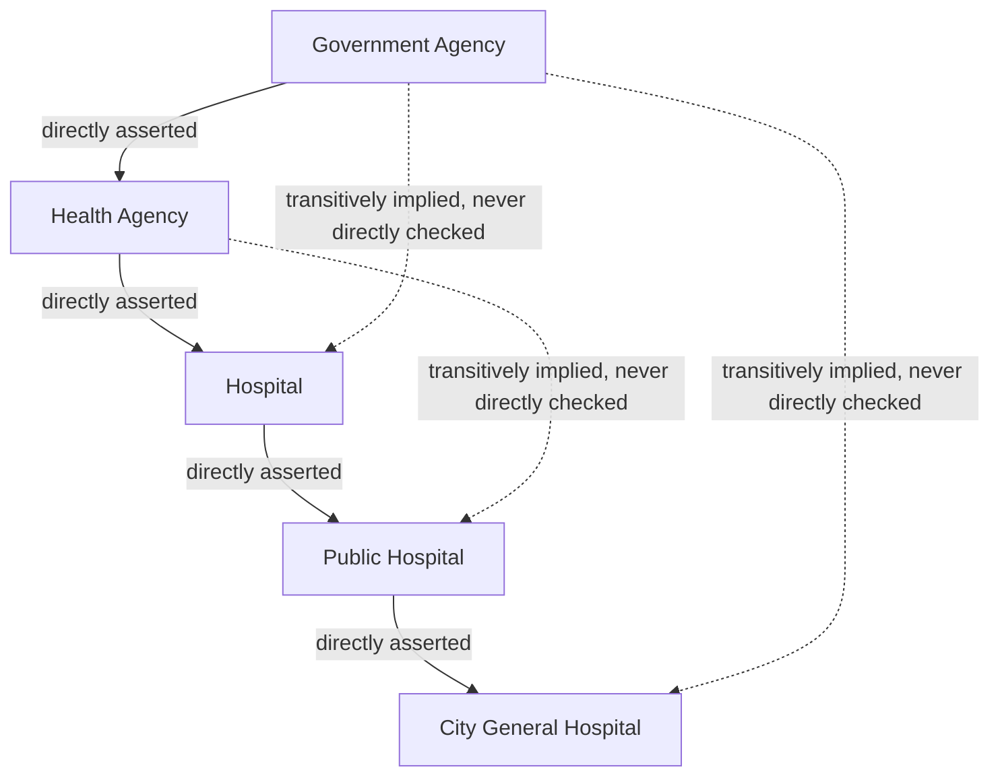

## Why Transitivity Is a Property We Would Want a Set of Subsumption Judgments to Have, Stated as a Formal Expectation

### A Database Analogy for Wanting Transitivity

Anyone who has worked with a foreign-key hierarchy already has an intuition for why transitivity matters, even without the word. Suppose a database models organizational reporting structure: an `employee` table where each row has a `reports_to` column pointing at another employee. If Alice reports to Bob, and Bob reports to Carol, any query traversing that chain — "list everyone above Alice in the org chart" — silently assumes that reporting is transitive: if Alice is under Bob and Bob is under Carol, Alice is under Carol too. Nobody has to state this assumption explicitly for a `WITH RECURSIVE` common table expression walking the `reports_to` chain to work correctly; the query's correctness *depends* on the relationship being transitive, because the whole point of walking the chain is to accumulate containment across multiple hops rather than re-verifying it at every single link.

Subsumption judgments in a knowledge graph are used exactly this way. Recall that subsumption is the relationship where a more general concept fully contains a more specific one — every instance of the specific concept is also an instance of the general one. When a graph-construction pipeline builds multi-level category hierarchies, it is implicitly relying on being able to walk a chain of subsumption edges and trust the endpoints, the same way the org-chart query trusts the endpoints of a `reports_to` chain without re-verifying every intermediate hop. This item states, formally, what that trust actually amounts to as a mathematical property, and why we would want it to hold.

### Stating the Formal Expectation

Transitivity, as a property of a relation, is a precise and familiar shape to any reader with general mathematical maturity: a relation $R$ is transitive if, whenever $A \mathrel{R} B$ and $B \mathrel{R} C$ hold, $A \mathrel{R} C$ is also guaranteed to hold. Applied to subsumption specifically, the expectation is:

$$\text{if } A \sqsubseteq B \text{ and } B \sqsubseteq C, \text{ then } A \sqsubseteq C$$

where $A \sqsubseteq B$ is read as "$A$ is subsumed by $B$," meaning every instance of $A$ is also an instance of $B$. In plain language: if every cardiologist is a physician, and every physician is a licensed medical professional, then it should follow — automatically, with no further checking required — that every cardiologist is a licensed medical professional.

It is worth being precise about *why* this is guaranteed rather than merely likely, because the guarantee is what makes transitivity valuable in the first place. Recall that subsumption was defined via a subset relationship between instance sets: $A \sqsubseteq B$ means $\text{instances}(A) \subseteq \text{instances}(B)$. Subset containment among sets is itself transitive as a basic fact of set theory — if set $X$ is a subset of set $Y$, and $Y$ is a subset of $Z$, then every element of $X$ is, by simply following the two containment facts in sequence, also an element of $Z$. There is no gap in that argument to inspect further; it follows directly from what "subset" means. Since subsumption was *defined* as subset containment over instances, subsumption inherits transitivity as a direct mathematical consequence of its own definition, not as an empirical property that happens to hold sometimes. This is the sense in which transitivity is a **formal expectation**: it is not a hopeful heuristic about how categories in the real world tend to behave, but a logical guarantee that follows immediately once you accept that "A is a type of B" means "every A is a B."

### A Worked Chain Showing the Guarantee in Action

Return to the five-level hierarchy from the worked example of a subsumption judgment: Government Agency, Health Agency, Hospital, Public Hospital, City General Hospital. Each adjacent pair was asserted to satisfy subsumption — every health agency is a government agency, every hospital is a health agency, and so on down the chain. Transitivity is the property licensing the *non-adjacent* conclusions that were never directly asserted at all:

Only the four solid arrows were ever individually verified — presumably by whatever process (an LLM judgment, a curated ontology, a human annotator) produced this hierarchy in the first place. Nobody ever directly checked whether "City General Hospital" is a "Government Agency" — that fact was never independently asserted anywhere. Transitivity is precisely the property that licenses treating that unchecked, multi-hop conclusion as though it *had* been checked: because each individual link was verified and subsumption is transitive by definition, the four-hop conclusion is guaranteed to be exactly as reliable as the individual links that compose it, with no additional verification cost. This is what makes transitivity practically valuable rather than merely mathematically tidy: it is a **compression of verification effort**, letting a system check $n-1$ adjacent links along a chain of length $n$ and receive, for free, all $\binom{n}{2}$ pairwise conclusions among every pair of nodes on that chain.

### Why We Would Want This Property, Stated as an Engineering Motivation

The formal guarantee matters to this curriculum's concerns for a very concrete reason: a knowledge-graph construction pipeline that builds category hierarchies incrementally, one new node and one new edge at a time, cannot afford to re-verify every possible pair of nodes in the graph every time a new one is added. If a graph already has a thousand category nodes arranged in a hierarchy and a new entity arrives, checking that entity's relationship against every one of the thousand existing categories directly would be exactly the kind of linear, per-insertion cost this curriculum has been at pains to analyze and avoid — and even a linear-cost check is optimistic, since the interesting question is usually not just "does this new entity relate to node X" but "where in the *entire hierarchy* does it belong," which naively could require examining relationships at every level.

Transitivity is what makes a sparser strategy sound: verify a new entity's subsumption relationship against only its *immediate* candidate parent in the hierarchy, and trust that its relationship to every ancestor further up the chain follows automatically, without separately checking each one. Attaching "City General Hospital" under "Public Hospital" with a single verified edge is intended to *automatically* and correctly place it under "Hospital," "Health Agency," and "Government Agency" as well, purely as a consequence of the chain's transitivity, with no need to separately verify those three additional relationships. This is precisely the same shape of argument, applied to correctness of category placement rather than to raw computational cost, as the reasoning that makes a well-designed incremental data structure avoid redoing full work on every operation: a local check is being trusted to imply a global guarantee, and the soundness of that trust rests entirely on a formal property — transitivity, in this case — actually holding.

### Naming the Assumption This Item Deliberately Isolates

This item's scope is limited, on purpose, to stating what transitivity *is* and why it would be a genuinely useful property for a set of subsumption judgments to possess, reasoning entirely from the clean mathematical case where subsumption is defined precisely as subset containment among instance sets, as in a hand-built ontology or a strictly logical formal system. In that clean setting, transitivity is not an assumption at all — it is a theorem, following immediately and without exception from the definition of subset containment, exactly as shown above.

The unstated tension this item deliberately leaves open is what happens when the individual subsumption judgments feeding into a chain like this are no longer the output of a strict logical definition, but are instead individually rendered, one link at a time, by an LLM acting as a semantic judge — a process shown, when discussing the concept as distinct from a similarity score, to be a generative, language-based act of relational reasoning rather than an application of a fixed formal rule. Nothing about that generative judgment process comes with the same built-in mathematical guarantee that strict set-theoretic subset containment carries automatically. Whether a *chain* of individually-plausible-looking LLM subsumption judgments actually composes into a transitively sound conclusion the way the clean mathematical case guarantees is exactly the question this chapter turns to next, using a specific worked failure — the Healthcare Facilities and Hospitals example — to show precisely how and where that composition can break down in practice, even when every individual link in the chain looked correct in isolation.

**Related Topics**

- The Healthcare Facilities and Hospitals worked failure example, showing transitivity breaking down across individually plausible LLM judgments
- Why an LLM's judgment process lacks the built-in guarantee that formal set-theoretic subset containment carries automatically
- The downstream cost of assuming a subsumption chain is valid without verifying each link end-to-end
- Other properties of relations worth checking (reflexivity, antisymmetry) and whether subsumption satisfies them
- Formal ontology engineering as a discipline that enforces transitivity by construction rather than hoping for it
- Verification strategies for catching transitivity violations in an incrementally built graph