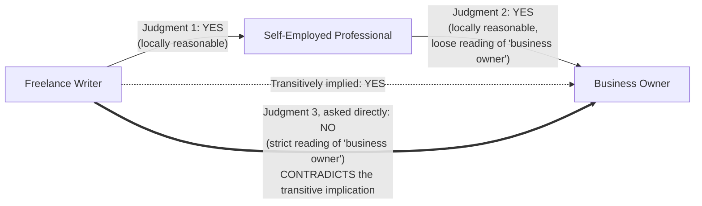

## Why Transitivity Is Not Automatically Guaranteed Just Because Each Individual Judgment Seems Locally Reasonable

### A Systems Analogy: When Locally Correct Steps Don't Compose

Floating-point arithmetic gives a precise, familiar illustration of a general phenomenon worth naming before applying it to subsumption. Real-number addition is associative: $(a+b)+c$ always equals $a+(b+c)$. Floating-point addition, as implemented by IEEE 754 hardware, is not. Each individual addition is *locally* correct — the hardware faithfully computes the correctly-rounded result of adding the two operands it was given, exactly as specified. And yet, because each step introduces its own small, independently reasonable rounding decision, the order in which additions are grouped can change the final sum. No single step in either grouping was wrong. The property that broke — associativity — was a property of the *composition* of steps, not a property that any individual step was responsible for preserving, and nothing about each step being individually defensible forced the composed result to come out the same both ways.

A closely related and even more directly relevant example lives in JavaScript's loose equality operator. Each of the following three comparisons, evaluated in isolation, reflects a coercion rule that is individually documented and locally sensible under that rule: `0 == "0"` evaluates to `true` (the string is numerically coerced), `0 == ""` evaluates to `true` (the empty string coerces to zero), yet `"0" == ""` evaluates to `false` (two strings are compared without numeric coercion, and they are not the same string). Equality, as a genuine mathematical relation, is supposed to be transitive: if $a$ equals $b$ and $b$ equals $c$, then $a$ should equal $c$. Loose equality in JavaScript violates this on ordinary values, not through any bug, but because each pairwise comparison silently applies its own locally-triggered coercion rule depending on the *specific pair* of operand types it happens to see, rather than consulting one single, fixed, globally consistent notion of "sameness" across every comparison. This is the exact structural shape of the problem this item is about, transplanted into a knowledge-graph setting: pairwise judgments, each locally defensible under the rule actually applied to that specific pair, fail to compose into a transitive whole because the rule being applied silently shifts from one pairwise comparison to the next.

### Recalling Why the Formal Guarantee Held

Recall that subsumption's transitivity was shown to be, in the clean mathematical case, not an assumption but a direct logical consequence of definition: $A \sqsubseteq B$ was defined to mean $\text{instances}(A) \subseteq \text{instances}(B)$, and subset containment among sets is transitive as a basic fact of set theory, with no gap left to inspect. The proof went through cleanly because every occurrence of $\text{instances}(A)$ in the argument referred to the *same fixed set*, no matter which pairwise comparison was being made. The entire guarantee rests on that single premise: that "the instances of $A$" is one stable, unambiguous thing, referenced identically every time $A$ appears in any judgment, anywhere in the chain.

That premise is exactly what an LLM-rendered judgment does not, and structurally cannot, guarantee.

### The Mechanism: Independently Generated Judgments, Not Lookups Against a Fixed Definition

Recall that an LLM judgment is the output of an autoregressive generation process — the model producing a response conditioned on the specific prompt in front of it, drawing on trained-in patterns of relational reasoning, rather than the model consulting one persistent, symbolic, globally shared definition of what a category's boundary is. Each time a subsumption question is posed to the model — "Is every $A$ a $B$?" — that question is answered *fresh*, in isolation, conditioned only on the wording of that specific prompt and whatever surrounding context happens to be present. There is no mechanism ensuring that the model's implicit working notion of what counts as "an instance of $B$" in one comparison is the same implicit notion it uses when $B$ appears again in a different comparison later in the chain.

This matters because almost no natural-language category label denotes a single, crisp, universally agreed set of instances the way a formally defined mathematical category does. Real category labels are frequently vague at the edges, and — more importantly for this mechanism — their effective boundary can shift depending on what they are being contrasted against. A concept can be interpreted broadly when it is being compared to something clearly narrower than it (where a loose, generous boundary makes the "yes" answer obviously safe) and interpreted narrowly when it is being compared to something that requires a stricter reading to still count as true. Nothing forces these two implicit interpretations, invoked in two different pairwise comparisons, to coincide.

### A Worked Example of the Break

Consider three concepts a pipeline might extract while processing text about gig-economy workers:

- Freelance Writer
- Self-Employed Professional
- Business Owner

Posed as two separate pairwise subsumption questions, each individually plausible:

**Judgment 1:** "Is every freelance writer a self-employed professional?" A reasonable answer is yes — freelance writing is, definitionally, work performed on a self-employed basis rather than as someone's traditional employee.

**Judgment 2:** "Is every self-employed professional a business owner?" Interpreted with a fairly loose, generous reading of "business owner" — anyone who runs their own professional practice, even a sole proprietorship with no employees or formal registration — a reasonable answer is also yes.

Chaining these two locally reasonable "yes" answers via transitivity produces the conclusion: every freelance writer is a business owner.

**Judgment 3, posed directly:** "Is every freelance writer a business owner?" Asked this way, without the intermediate concept present to anchor a loose reading of "business owner," a model may reasonably shift toward a stricter interpretation of what "business owner" denotes — someone who owns a formally structured business entity, perhaps with registration, overhead, or employees — under which a great many freelance writers, who simply invoice clients as individuals with no such structure, would not qualify. A reasonable direct answer here is no.

Every individual judgment in this diagram is, on its own, a defensible answer to the exact question it was asked. Nothing in the diagram represents a model making an obvious mistake anywhere. The failure is not locatable inside any single edge — it is a property of the composition, visible only once the transitively implied conclusion is checked directly against a fresh, independent judgment and found to disagree with it. This is structurally identical to the JavaScript loose-equality case: no single `==` comparison was a bug, and the failure only becomes visible once you check the triangle of three comparisons together.

### Why "Locally Reasonable" Is the Wrong Thing to Have Verified

The deeper point this worked example is meant to isolate is that verifying each individual link in a subsumption chain for local plausibility — does this one pairwise judgment sound right on its own? — is verifying a different, weaker property than the one transitivity actually depends on. Transitivity's proof needed every reference to a shared concept, across every judgment in the chain, to be anchored to the *same* underlying extension. Checking that each judgment is individually plausible says nothing about whether that anchoring condition held, because a model can produce a perfectly plausible-sounding answer at every single step while silently drawing the boundary of "Business Owner" differently at step 2 than it would if asked about it directly at step 3. Local plausibility is necessary for a chain to be trustworthy, but this example demonstrates it is not sufficient, and mistaking the two is precisely the trap a pipeline falls into if it accepts a chain of pairwise-approved judgments as proof of a multi-hop conclusion without ever separately checking that conclusion.

### The Stakes for Incremental Graph Construction

Recall that a well-designed pipeline would like to verify a new entity's subsumption relationship against only its immediate candidate parent and trust the rest of the hierarchy above it by transitivity, precisely to avoid the cost of re-checking every ancestor individually. This item is the precise statement of why that shortcut is not free when the underlying judgments come from an LLM rather than a fixed formal definition: a locally sound-looking attachment decision at insertion time can silently imply a false relationship several levels up a hierarchy, with no single step in the process having looked wrong, and no natural point at which the error would surface unless something specifically goes looking for it. The graph does not fail loudly when this happens — it simply becomes quietly, structurally wrong in a way that ordinary spot-checking of individual edges will not catch, because every individual edge, examined on its own, still looks fine.

**Related Topics**

- The Healthcare Facilities and Hospitals worked failure example as a fully traced, domain-specific instance of exactly this breakdown
- The downstream cost of assuming a subsumption chain is valid without verifying its multi-hop conclusion directly
- Calibration and consistency of LLM judgments across reordered or differently-anchored prompts
- The generator-verifier-pruner architectural pattern as a systems-level response to this failure mode
- Why vague, context-dependent natural-language category boundaries differ structurally from a fixed set-theoretic extension
- Detecting transitivity violations after the fact versus preventing them at insertion time