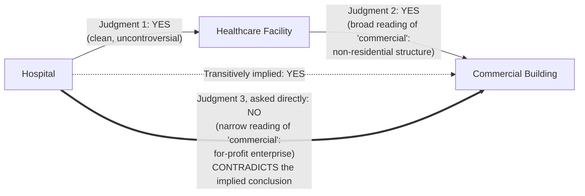

## Working Through the Concrete Healthcare Facilities, Hospitals, and Commercial Building Example Where Two Locally Sensible Judgments Produce a Contradiction

### Setting Up the Three Concepts

This item traces one specific, fully worked instance of the general breakdown established when discussing why transitivity is not automatically guaranteed just because each individual judgment seems locally reasonable: a chain in which every pairwise step, examined on its own, looks like a correct answer, and yet the chain as a whole implies a conclusion that a direct, independent judgment rejects. The three concepts involved are:

- **Hospital** — a specific, familiar institutional category: a facility providing inpatient medical treatment, surgery, and emergency care.
- **Healthcare Facility** — a broader umbrella category covering any building or institution whose primary function is delivering health-related services: hospitals, clinics, diagnostic laboratories, rehabilitation centers, and public health offices all fall under it.
- **Commercial Building** — a category from building classification and zoning vocabulary, denoting a structure used for business or commercial purposes, as distinct from a residential building.

These three were chosen deliberately because each pairwise relationship between them has an intuitive, defensible-sounding answer, and because the third category, "Commercial Building," carries a word — "commercial" — whose meaning quietly shifts depending on what it is being contrasted against, which is exactly the mechanism the previous item identified as the root cause of this class of failure.

### Judgment 1: Is Every Hospital a Healthcare Facility?

Posed as a subsumption question — recall that subsumption asks whether every instance of a more specific concept is necessarily an instance of a more general one — this judgment is about as clean as this kind of question gets. A hospital's defining function, providing medical treatment, falls squarely and unambiguously inside the defining function of a healthcare facility, delivering health-related services. There is no plausible instance of a hospital that fails to also be a healthcare facility.

**Judgment 1 (direct, high-confidence): YES — every hospital is a healthcare facility.**

Nothing about this step is contentious, and it is not the source of the problem this item traces. It establishes the first link of the chain cleanly.

### Judgment 2: Is Every Healthcare Facility a Commercial Building?

This is where the locally reasonable but consequential interpretive choice enters. Posed in isolation, "is every healthcare facility a commercial building?" invites a reading of "commercial building" in its broad, building-classification sense: a non-residential structure, built and used for institutional or business purposes rather than as someone's home. Under that broad reading, a healthcare facility clearly qualifies — it is not a residence, it is a purpose-built or purpose-converted structure serving an organizational function, exactly the category "commercial building" is meant to capture in contrast to "residential building" in zoning and real-estate classification schemes.

**Judgment 2 (direct, plausible under the broad reading): YES — every healthcare facility is a commercial building.**

This judgment is not obviously wrong when read this way. A reasonable classifier, prompted with no further context steering it toward a narrower sense of "commercial," could easily produce this answer, and a human skimming it in isolation would likely find it unremarkable.

### The Transitively Implied Conclusion

Chaining Judgment 1 and Judgment 2 through transitivity — recall that transitivity licenses concluding $A \sqsubseteq C$ whenever $A \sqsubseteq B$ and $B \sqsubseteq C$ have both been established — produces:

$$\text{Hospital} \sqsubseteq \text{Healthcare Facility} \sqsubseteq \text{Commercial Building} \implies \text{Hospital} \sqsubseteq \text{Commercial Building}$$

In plain language: every hospital is a commercial building. This conclusion was never independently asserted anywhere — it exists purely as a consequence of composing the two prior judgments, exactly the kind of "compression of verification effort" that made transitivity valuable enough to want in the first place.

### Judgment 3: Checking the Implied Conclusion Directly

Now pose the composed conclusion as its own direct question, with no intermediate category present to anchor a reading: "Is every hospital a commercial building?"

Asked this way, the natural reading of "commercial" shifts. Without "Healthcare Facility" sitting between the two terms to invite the broad, building-classification sense of "commercial," the question instead tends to surface the narrower, more common everyday sense of "commercial": operated for profit, as a business, in the way "commercial airline" or "commercial bakery" implies a for-profit enterprise. Under that narrower reading, the answer changes sharply, because a very large share of real-world hospitals are not commercial in this sense at all — they are government-operated public hospitals, non-profit charitable institutions, or university-affiliated teaching hospitals, none of which are "commercial" in the for-profit-business sense, even though every one of them is unquestionably a healthcare facility and unquestionably not a residence.

**Judgment 3 (direct, high-confidence): NO — not every hospital is a commercial building; many hospitals are public or non-profit institutions, not commercial enterprises.**

This is now a direct contradiction. The chain of two individually defensible judgments implies "yes." The direct, independently posed judgment about the same conclusion says "no."

### Diagnosing Exactly Where the Break Occurred

It is important to locate the failure precisely, because it is easy to misdiagnose. The failure is not in Judgment 1 — that link is sound under any reasonable reading of "healthcare facility." The failure is also not simply "Judgment 2 was wrong" in some absolute sense — under the broad, building-classification sense of "commercial," Judgment 2's answer is defensible too. The failure is that the word "commercial" in Judgment 2 and the word "commercial" in Judgment 3 are being resolved to two different senses, and nothing in the pairwise judgment process forced them to be resolved consistently, because — recall — each LLM judgment is generated fresh, conditioned only on the specific prompt in front of it at that moment, with no persistent, symbolic definition of "Commercial Building" being consulted identically across every occurrence.

This is the exact mechanism named in the general case: transitivity's formal guarantee depends on every reference to a shared concept, across every judgment in the chain, being anchored to the same underlying extension — recall that the proof of transitivity for subsumption relied on $\text{instances}(B)$ meaning the identical set every time $B$ appeared. Here, "instances of Commercial Building" quietly meant "non-residential structures" in one judgment and "for-profit business premises" in another. The chain's individual steps never violated any rule they were asked to follow; the rule itself — what "Commercial Building" denotes — silently changed shape between one pairwise comparison and the next.

### Why Neither Individual Judgment Was an Obvious Mistake

A useful discipline here is resisting the urge to declare one of the two feeder judgments simply "the wrong one." If a pipeline's remediation strategy were "just make the LLM more careful so Judgment 2 comes out correctly," it would be solving the wrong problem, because Judgment 2 is not incorrect in isolation — it is only in tension with Judgment 3 once both are held next to each other and their composition is checked. A model that consistently applies the broad sense of "commercial" whenever asked about buildings in a healthcare-adjacent context, and consistently applies the narrow, for-profit sense whenever asked about a well-known public-institution category like "hospital" directly, is behaving in a way that mirrors ordinary human usage of the word "commercial" — the ambiguity being exploited here is a genuine feature of the English word, not an artifact of the model being careless. This is precisely why checking each link for local plausibility, as flagged in the prior item, is not sufficient: both links pass a local-plausibility check, and the contradiction is only visible at the level of the composed conclusion.

### The Concrete Downstream Cost

Suppose a knowledge-graph construction pipeline actually built its hierarchy this way: a new hospital entity is extracted from text, attached under "Healthcare Facility" (a sound decision, Judgment 1), and "Healthcare Facility" itself was earlier attached under "Commercial Building" during an earlier insertion (Judgment 2, made independently, without "Hospital" anywhere in view). The pipeline never separately re-verifies "is this new hospital a commercial building?" — the entire point of relying on transitivity, recall, was to avoid re-checking every ancestor relationship at insertion time. The graph now silently encodes, as a fact available to every downstream query and every LLM-based reasoning step built on top of this graph, that this specific public hospital is a commercial building. A downstream question like "list all commercial enterprises the city government has fiscal oversight of" could now incorrectly enumerate public hospitals as commercial businesses, purely because a category-level ambiguity, resolved two different ways in two different pairwise judgments made possibly weeks apart during incremental graph growth, was never reconciled — and nothing about the graph's structure signals that anything is wrong, because every individual edge in it, inspected on its own, still looks like a locally sensible judgment.

### Why This Example Was Worth Working Through in Full

This case was chosen because it demonstrates the failure mode without requiring any esoteric or contrived category labels — every one of "Hospital," "Healthcare Facility," and "Commercial Building" is an ordinary, common term, and the ambiguity driving the contradiction is a real, everyday ambiguity in how the word "commercial" is used, not a manufactured edge case. This is the point: transitivity violations of this shape are not rare pathological inputs that a system can reasonably hope to never encounter — they are a structural consequence of using natural language, with its context-sensitive word senses, as the medium for rendering judgments that a formal system needs to compose reliably. Any sufficiently large, incrementally built hierarchy of natural-language category labels should be expected to contain latent instances of exactly this pattern, discoverable only by checking composed conclusions directly rather than trusting that locally sound pairwise judgments are enough.

**Related Topics**

- The downstream cost of assuming a subsumption chain is valid without verifying its multi-hop conclusion directly
- The generator-verifier-pruner architectural pattern as a systems-level defense that checks composed conclusions rather than only pairwise edges
- Word-sense ambiguity and context-dependent category boundaries as a general obstacle to consistent LLM judgments
- Strategies for detecting transitivity violations after a graph has already been built
- Prompt design techniques that surface and disambiguate a term's intended sense before a judgment is rendered
- Building and maintaining knowledge graphs incrementally under known, unavoidable sources of judgment inconsistency