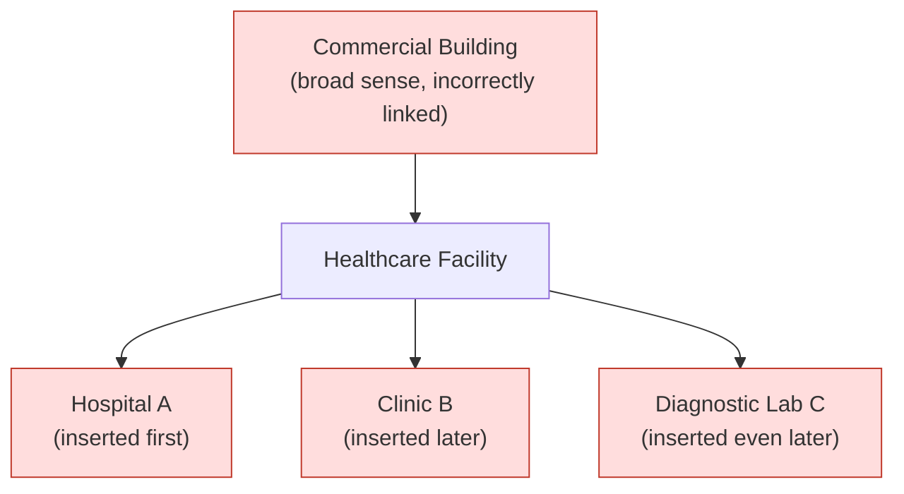

## What Breaks Downstream in a Knowledge Graph When a Set of Subsumption Judgments Is Not Transitive

### A Database Analogy: When a Materialized View Trusts a Broken Invariant

Consider a reporting database with a `department_hierarchy` table encoding which departments report up into which broader divisions, and a materialized view, `division_headcount`, that sums employee counts by walking that hierarchy and rolling every department's staff up into its top-level division. The view's correctness depends entirely on one invariant holding: the reporting-chain relationship it walks must actually be transitive, so that "rolls up into" computed by chaining several hops means the same thing as "rolls up into" computed directly. If that invariant silently breaks somewhere in the middle of the table — a data-entry error creates a chain where department A reports into B, B reports into C, but A was never actually meant to be counted under C's headcount for budgeting purposes — the view does not crash. It produces a headcount number that looks completely normal, gets used in a budget planning meeting, and is wrong in a way nobody in that meeting has any way of detecting just by looking at the final number.

This is the general shape of every downstream consequence in this item: a non-transitive set of subsumption judgments does not produce a graph that fails loudly. It produces a graph that continues to answer every query, continues to look structurally healthy under casual inspection, and quietly returns wrong answers to exactly the queries that rely on multi-hop reasoning across the broken part of the hierarchy — which, in a knowledge graph, is most of them.

### Recalling the Setup

Recall the worked Healthcare Facilities, Hospitals, and Commercial Building example: two individually defensible subsumption judgments — every hospital is a healthcare facility, and every healthcare facility is a commercial building — composed via transitivity into a conclusion — every hospital is a commercial building — that a direct, independent judgment rejected. That example traced *how* the contradiction arises. This item is about what actually goes wrong operationally, downstream, once a graph has been built while carrying that kind of latent inconsistency, and it is worth being systematic about the distinct categories of breakage, because they are not all the same failure.

### Breakage One: Silently Incorrect Query Results

The most direct consequence is that any graph query relying on multi-hop traversal through the broken portion of the hierarchy returns an answer that is wrong, with no error signal anywhere in the process. If the graph encodes "Hospital → Healthcare Facility → Commercial Building" as a real, traversable edge chain, then a query like "list all commercial buildings the city has a fiscal reporting obligation for" — implemented, as such queries typically are, as a graph traversal that walks every subsumption edge downward from the "Commercial Building" node — will enumerate every hospital in the graph as a matching result. The query executed correctly, from the traversal engine's point of view: it walked exactly the edges the graph told it to walk. The wrongness lives entirely in the data, not in the query logic, which is precisely why this class of failure is so difficult to catch through code review or testing of the query layer itself — the query layer has no defect to find.

This is structurally the same failure as a `WITH RECURSIVE` query walking a `reports_to` chain in the database analogy: the recursive traversal is a generically correct, well-tested piece of query logic, applied faithfully to data whose transitivity invariant has been silently violated somewhere upstream of the query itself.

### Breakage Two: Contradictory Facts Coexisting Without Detection

A subtler and, in some ways, more corrosive breakage is that a non-transitive hierarchy permits the graph to simultaneously contain two facts that a human, or a downstream reasoning system, would recognize as being in tension — without any structural signal flagging the tension. In the worked example, nothing prevents the graph from holding both the multi-hop-implied fact "Hospital is-a Commercial Building" (reachable via traversal) and a separately, directly recorded fact elsewhere in the graph stating that a specific hospital is publicly funded and explicitly non-commercial. Ordinary relational or graph query mechanisms have no built-in obligation to check consistency between a directly asserted fact and a multi-hop-derived one; they will happily return both when separately queried, and only a reasoning process specifically designed to cross-check derived conclusions against direct assertions would ever surface the contradiction. Left unchecked, a graph can accumulate an arbitrary number of these latent contradictions over the course of incremental construction, each individually invisible, collectively degrading the graph's reliability as a source of truth in a way that has no natural point of discovery.

### Breakage Three: Compounding Errors Across Further Insertions

Because this curriculum's central concern is a graph that grows incrementally, one insertion at a time, a third and distinctly dangerous breakage is that a bad transitive link, once present, becomes a foundation that subsequent insertions build on top of without re-examination. Recall that the entire practical motivation for wanting transitivity was to let a pipeline verify a new entity's relationship against only its *immediate* candidate parent and trust the rest of the ancestor chain by composition, rather than re-checking every ancestor at every insertion — an efficiency argument this curriculum has been making since the cost-of-growth framing established earlier in this chapter. If "Healthcare Facility" has already been incorrectly wired under "Commercial Building" in the broad sense of "commercial," then every subsequent insertion of a new healthcare-related entity that gets attached under "Healthcare Facility" — a new clinic, a new diagnostic laboratory, a new public health office — inherits the same latent misclassification automatically, at zero additional judgment cost, purely because the pipeline is (correctly, by its own design) trusting the chain above the immediate parent rather than re-deriving it. The error does not stay localized to the single pair of nodes where it originated; it propagates outward to every future node attached anywhere beneath the compromised link, silently, for as long as the graph continues growing.

Every node shaded here inherits the same latent misclassification, and every one of those insertions could have been individually judged correct at insertion time — attaching "Clinic B" under "Healthcare Facility" is a perfectly sound decision on its own terms — while still compounding a pre-existing structural error none of these later insertion decisions had any way of noticing.

### Breakage Four: Undermining Any Downstream LLM Reasoning Built on Top of the Graph

If the graph is later used as retrieved context feeding a further LLM-based reasoning step — a common pattern where an LLM answers a question by first retrieving relevant subgraph structure and then reasoning over it — a broken transitivity chain does not just corrupt a direct traversal query; it corrupts the *premises* available to that further reasoning step. Recall that an LLM judgment is generated fresh, conditioned on whatever is in its prompt; if the prompt hands the model a retrieved fact stating "Hospital is-a Commercial Building" as established graph context, the model has no independent way to know this fact is a transitively-derived artifact of a stale, narrowly-scoped judgment rather than a directly verified assertion, and it will reason forward from it exactly as it would reason from any other retrieved fact. The error, originally a subtle ambiguity in one word's sense during one pairwise judgment, has now been laundered into an apparently authoritative graph fact and handed to a downstream reasoning process as though it were ground truth.

### Why the Failure Mode Is Specifically Dangerous Rather Than Merely Inconvenient

What distinguishes this class of breakage from an ordinary software bug is the complete absence of a natural failure signal. A crashed process, a thrown exception, a query returning zero rows when rows were expected — all of these announce themselves. A transitivity violation in a subsumption hierarchy produces a graph that remains fully queryable, fully populated, and superficially coherent at every individual edge, while returning specific wrong answers only along specific traversal paths that happen to cross the broken link, and only when something eventually asks the right question to expose it. This is precisely why the practical response cannot be "make individual judgments more careful" — the Healthcare Facilities example demonstrated that individually careful judgments are exactly the failure mode's raw material — and must instead be architectural: a system-level mechanism that specifically checks composed, multi-hop conclusions against independent direct judgments, rather than trusting that a chain of locally sound pairwise decisions is sufficient on its own.

**Related Topics**

- The generator-verifier-pruner architectural pattern as a systems-level defense against exactly this class of silent error
- Detecting transitivity violations after a graph has already been built, versus preventing them at insertion time
- Graph drift under streaming updates as a related, compounding source of long-run structural degradation
- Consistency-checking strategies that cross-reference derived, multi-hop facts against directly asserted ones
- The cost tradeoff between re-verifying every ancestor at insertion time and trusting a potentially fragile transitive chain
- A fully worked small insertion example applying every tool from this curriculum to catch this kind of error in practice