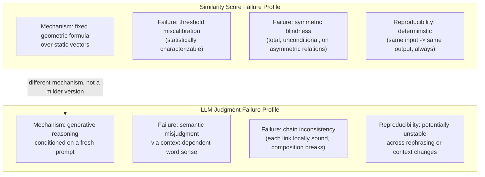

## Comparing the Failure Modes of a Numeric Similarity Threshold Against the Failure Modes of an LLM Judgment, and Why They Are Different in Kind, Not Just in Degree

### A Systems Analogy: Two Different Classes of Bug

A fixed numeric threshold in a similarity-based system fails the way an off-by-one error in a loop bound fails: deterministically, reproducibly, and in a way that a careful enough analysis of the formula and the data distribution could, in principle, fully characterize in advance. Given the same two vectors and the same threshold, the system makes the same decision every single time, and the boundary between "match" and "no match" is a literal geometric surface that can be drawn, inspected, and reasoned about with certainty.

An LLM judgment fails the way a race condition fails: not in a way any single execution trace makes obviously wrong, not fully reproducible under superficially identical conditions, and not characterizable in advance by inspecting a fixed formula, because there is no fixed formula — there is a generative process whose output depends on exactly how a question was phrased, what surrounding context happened to be present, and patterns absorbed during training that no closed-form description captures. This item's claim is that these two failure profiles are not the same kind of problem showing up at different severities — they are genuinely different species of failure, arising from genuinely different underlying mechanisms, and treating one as a milder or harsher version of the other misdiagnoses both.

### Recalling the Two Underlying Mechanisms

Recall that a similarity score is the output of applying a fixed, non-reasoning geometric formula — a dot product, a normalization, an angle computation — identically to any pair of vectors, with the formula having no access to what the underlying text actually means beyond however that meaning was encoded, once, by the embedding function. Recall separately that an LLM judgment is the output of an autoregressive generation process, conditioned on a specific prompt, drawing on trained-in patterns of relational reasoning rather than consulting one persistent, symbolic definition. Every failure mode catalogued below traces back to one or the other of these two mechanisms, and the fact that the mechanisms are structurally different is exactly why their failure modes cannot be placed on a single shared scale of "more or less wrong."

### Failure Mode Category One: Threshold Miscalibration Versus Semantic Misjudgment

A similarity-based system's characteristic failure is **threshold miscalibration**: the chosen cutoff — merge if similarity exceeds 0.75, say — is a single global number applied uniformly across every possible pair of concepts, and no single number can be simultaneously correct for every region of the embedding space. Some genuinely synonymous pairs will happen to land below the cutoff due to how the embedding model happened to encode them (a false negative), and some genuinely unrelated pairs sharing incidental vocabulary or context will happen to land above it (a false positive) — recall the worked example where "City Health Office" and "Health Insurance Office" could land at a similar cosine score to "City Health Office" and "Municipal Health Department" for entirely different underlying reasons. This failure is a **calibration problem**: it can be characterized statistically, its rate can be estimated empirically by testing the threshold against labeled data, and it can, in principle, be tuned — moving the threshold up trades false positives for more false negatives and vice versa, and there is a describable curve of that trade-off.

An LLM judgment's characteristic failure is not a calibration problem at all, because there is no single scalar cutoff to recalibrate. Its failure is **semantic misjudgment under context-dependent word sense**, as demonstrated in the Healthcare Facilities and Hospitals example: the model does not fail because a numeric boundary was drawn in the wrong place, it fails because the same word — "commercial" — silently resolved to two different senses depending on which concept it was being compared against. There is no single parameter analogous to a threshold that a pipeline designer could adjust to fix this; the failure is embedded in the flexibility of natural language itself, which is precisely the capability that makes the LLM judgment useful for asymmetric, categorical, relational questions in the first place. You cannot tune away the failure mode without also removing the flexibility that was the entire point of using an LLM judge instead of a fixed formula.

### Failure Mode Category Two: Symmetric Blindness Versus Chain Inconsistency

A similarity score's structural limitation is that it is symmetric by construction — recall $\cos(\vec{a}, \vec{b}) = \cos(\vec{b}, \vec{a})$ always, with no exception — and therefore cannot, even in principle, represent a directional relationship like subsumption correctly. This is not a failure that occurs *sometimes*, under unlucky data; it is a failure that is *guaranteed* to occur on every asymmetric relationship the system is ever asked to evaluate, because the mathematical object being computed has no capacity to encode direction at all. It is, in this precise sense, a total and unconditional blind spot rather than a probabilistic error rate.

An LLM judgment does not share this particular blind spot — it can, and typically does, answer "is A a type of B" and "is B a type of A" differently when appropriate, because it is evaluating a directional relational question each time rather than reporting an undirected distance. But it trades this capability for a different structural vulnerability: because each judgment is generated fresh with no persistent shared definition anchoring a concept's boundary across multiple invocations, a *chain* of individually direction-correct judgments can still compose into a transitively inconsistent conclusion, exactly as traced through the Hospital / Healthcare Facility / Commercial Building example. The similarity score's failure is a fixed, universal incapacity affecting one entire relation type unconditionally; the LLM's failure is a variable, context-triggered inconsistency affecting composed chains of judgments that were each individually sound.

### Failure Mode Category Three: Deterministic Reproducibility Versus Instability Under Rephrasing

Given the identical pair of vectors and the identical formula, a similarity score reproduces exactly, every time, on any hardware, with no variance — this determinism is a direct consequence of computing a fixed formula over static, precomputed vectors. Whatever is wrong with a similarity-based decision is wrong consistently, which means it can be found once, through systematic testing, and will not spontaneously resolve itself or reappear differently later on the exact same input.

An LLM judgment carries no equivalent guarantee. [Unverified] The degree of instability varies by model, decoding settings such as temperature, and prompt design, and is not something this item can quantify in general, but it is a well-documented category of behavior in the literature on LLM evaluation that a model's judgment on a semantically identical question can shift depending on superficial variations in phrasing, the order in which options are presented, or which surrounding context happens to be included in the prompt — even when the underlying relational question being asked has not changed at all. This means a subsumption judgment verified once, at one point during incremental graph construction, is not guaranteed to be the judgment the same model would render if asked again later, under a differently worded prompt, even about the exact same pair of concepts. A similarity-based error, once found, stays found and stays exactly characterized; an LLM-judgment error can be present under one phrasing and absent under another, which makes both detecting and permanently fixing it a fundamentally different kind of engineering problem than tuning a threshold.

### Why the Difference Is in Kind and Not Merely in Degree

The temptation to treat these as points on a single severity scale — "the LLM judge is just a more sophisticated, more accurate similarity score" — misses that the two systems are not attempting the same computation with different amounts of precision. A similarity score is not a coarse approximation of what an LLM judgment computes; it is answering a different question (how close are these two points in a fixed geometric space) using a different kind of object (a static vector processed by a stable formula) than the question an LLM judgment answers (does this specific relational claim hold, reasoned freshly in context, expressed in language). Consequently, their failure modes do not sit on a shared axis where you could say the LLM's error rate is simply lower. A similarity threshold can never correctly handle an asymmetric relation, no matter how well calibrated — that failure is structural, not statistical, and no amount of tuning removes it. An LLM judgment can correctly handle the asymmetric case, and can even correctly handle the specific pairwise comparisons in the Healthcare Facilities chain, while still failing at the composition of those correct pairwise answers into a consistent multi-hop conclusion — a failure mode that has no analogue at all in a similarity-based system, because a similarity-based system has no equivalent concept of "composing" judgments through anything like subsumption chains in the first place.

### The Practical Consequence: Different Mitigations for Different Failure Species

Because the two failure profiles have different root causes, they call for different engineering responses, and applying the wrong one accomplishes nothing. Threshold miscalibration is addressed by adjusting where the cutoff sits, or by evaluating the trade-off curve between false positives and false negatives on labeled validation data — a well-understood, purely statistical tuning exercise. None of that machinery addresses chain inconsistency in LLM judgments at all, because there is no single number to move. Chain inconsistency instead calls for an architectural response that specifically checks composed, multi-hop conclusions against independently rendered direct judgments — catching contradictions like the Hospital / Commercial Building case after the fact, or restructuring the judgment process to avoid relying on transitive composition across ambiguous natural-language categories in the first place. Recognizing which failure species a given error belongs to is the necessary first step to choosing the right one of these two, entirely different, remedies — mistaking a chain-inconsistency error for a calibration problem, or vice versa, leads to tuning a knob that was never connected to the actual source of the mistake.

**Related Topics**
- The generator-verifier-pruner architectural pattern as a mitigation specifically shaped for chain-inconsistency failures
- Empirical calibration methodology for setting a similarity threshold against labeled validation data
- Reproducibility and consistency testing for LLM judgments under prompt rephrasing
- Two-stage embedding-plus-LLM pipelines as an architecture that deliberately routes different question types to the mechanism suited to them
- The downstream cost, in a graph, of chain-inconsistency errors versus threshold-miscalibration errors
- Distinguishing a theoretical failure guarantee (structural, unconditional) from an empirically measured error rate (statistical, tunable)