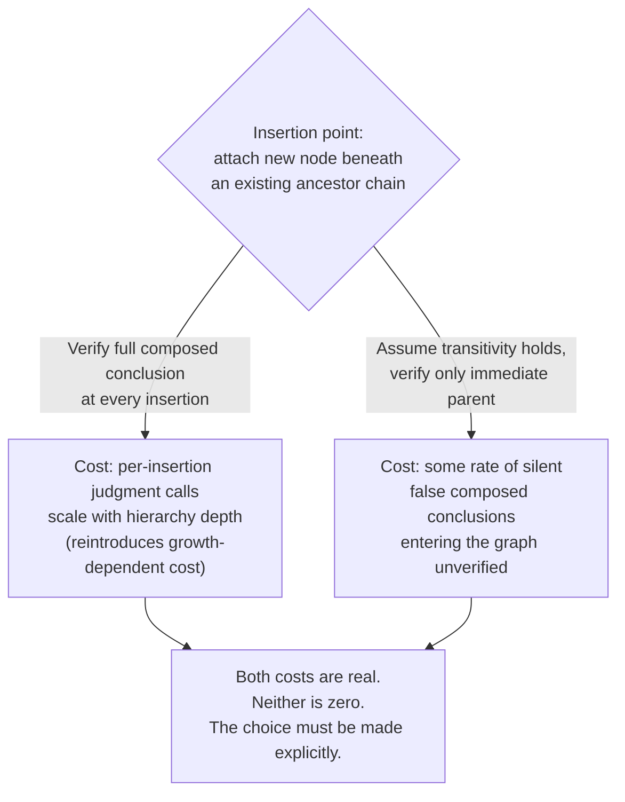

## Why Patching Non-Transitivity by Simply Assuming Transitivity Holds Is a Real Engineering Choice with a Real Cost, Not a Free Simplification

### A Systems Analogy: Caching Without an Invalidation Strategy

A cache that is never invalidated is not free performance — it is a deliberate bet that staleness either won't occur or won't matter, and the bet has a cost attached whether or not it ever gets called in. A team that adds a cache layer in front of a database and simply never writes an invalidation path has made an engineering choice: assume the cached value stays correct, in exchange for skipping the real work of tracking when it stops being correct. That choice is often reasonable — plenty of data genuinely is stable enough that the risk is negligible — but it is a choice with a quantifiable downside (serving stale data indefinitely, in whatever scenario the assumption fails) traded against a quantifiable upside (not building an invalidation mechanism at all). Nobody would describe skipping cache invalidation as "a free simplification"; they would describe it as a deliberate risk-cost trade-off, made explicitly, and revisited if the cost of being wrong turns out to be higher than expected.

Assuming a set of subsumption judgments composes transitively, without ever verifying the composed conclusion, is the identical kind of choice, made in the identical shape: skip a verification step, in exchange for the performance benefit that step would have cost, and accept whatever error rate results from the cases where the skipped verification would have caught something.

### Recalling Why the Assumption Is Tempting in the First Place

Recall that transitivity's practical value was framed explicitly as an efficiency argument: it lets a pipeline verify a new entity's subsumption relationship against only its immediate candidate parent and trust every relationship further up the ancestor chain automatically, without re-checking each one — a direct compression of verification effort from checking every pair to checking only adjacent links. Recall separately that this compression is a genuine mathematical guarantee in the clean case where subsumption is defined as strict subset containment over a fixed, stable extension, and recall that the Healthcare Facilities and Hospitals example demonstrated concretely that this guarantee does not automatically transfer to a chain of LLM-rendered judgments, because each judgment is generated fresh and can silently resolve an ambiguous term's sense differently at different points in the chain. The temptation to assume transitivity anyway, despite that demonstrated gap, comes from exactly the same place the caching-without-invalidation choice comes from: verifying every composed conclusion directly is expensive, and assuming the composition holds is cheap, so the assumption is attractive purely on cost grounds, independent of whether it is actually sound.

### Making the Trade-off Explicit Rather Than Implicit

The core claim of this item is that choosing to skip verification of composed conclusions is a legitimate engineering decision — it can be the *correct* decision, depending on context — but it stops being a legitimate decision the moment it is made silently, by default, without anyone having actually weighed the two sides of the trade-off against each other. There are two costs in tension here, and both need to be named on the table before the choice is made, not discovered afterward:

**The cost of verifying every composed conclusion.** If a pipeline insists on directly checking, via an independent LLM judgment, every multi-hop subsumption conclusion before accepting it into the graph — not just each new adjacent edge, but the full transitive closure implied by attaching a new node beneath an existing ancestor chain — the number of judgment calls required per insertion grows with the depth and branching of the hierarchy above the insertion point, rather than staying constant. For a hierarchy several levels deep, this could mean issuing several additional LLM calls per insertion solely to re-confirm relationships that transitivity, if it held, would have given for free. This directly reintroduces a cost profile the earlier discussion of the cost of growing a structure was specifically trying to avoid by leaning on amortized, sub-linear insertion strategies: recall that an ANN-index insertion strategy's whole appeal was changing the shape of the per-insertion cost curve away from linear growth in the size of the existing structure, and re-verifying an entire ancestor chain on every insertion reintroduces exactly the kind of per-insertion cost that grows with existing structure size that those strategies were designed to escape.

**The cost of assuming transitivity and being wrong.** If a pipeline instead accepts the compressed, cheap version — verify only the immediate parent link, trust the rest by composition — it inherits, unquantified unless someone measures it, some non-zero rate of exactly the failure traced in the Healthcare Facilities example: locally sound pairwise judgments producing a false composed conclusion that gets written into the graph as though it were verified fact, then silently propagating to every subsequent insertion attached beneath it, as catalogued when discussing what breaks downstream in a knowledge graph when a set of subsumption judgments is not transitive. This cost is real, but it is a probabilistic, deferred cost rather than an immediate, visible one — which is exactly what makes it easy to mistake for zero cost if nobody goes looking for it.

### Why This Is Not Symmetric to a Sound Amortization Argument

It is worth being precise about why "assume it and move on" is not simply the LLM-judgment version of an amortized-cost argument, because the two can superficially look alike and the resemblance is misleading. Recall that an amortized cost bound for something like a doubling dynamic array is a proven mathematical guarantee: the analysis shows, with certainty, that the total cost across any sequence of operations is bounded, and no operation in the sequence can ever violate that bound no matter what input it receives — the guarantee holds unconditionally, for every possible input, because it was derived from the actual mechanics of the doubling scheme. Assuming subsumption transitivity holds across a chain of LLM judgments carries no equivalent unconditional guarantee: it is not a proven bound on an error rate, it is an unverified hope that a specific instance of the pattern demonstrated in the Healthcare Facilities example simply will not occur in this particular graph. Calling the two the same kind of "efficient shortcut" mistakes a mathematically guaranteed amortization for a probabilistic gamble with an unmeasured failure rate — the amortized-cost argument earns its efficiency through proof, while assuming transitivity here earns its efficiency only by not looking for the cases where it fails.

### What Making the Choice Explicitly Actually Looks Like

Treating this as a genuine engineering decision, rather than a default nobody examined, means at minimum being able to answer several concrete questions before committing to the assumption: How deep and how broad does the hierarchy actually get in this graph, since deeper chains give more opportunities for a word-sense shift like the "commercial" example to enter undetected? How costly, in terms of downstream query correctness, is a specific instance of a wrong composed conclusion — is it a minor inconvenience or does it feed into a decision-relevant query, the way the earlier fiscal-oversight example did? And is there a cheaper middle ground than either extreme — for instance, spot-checking a sample of composed conclusions after the fact, or verifying full composition only near hierarchy nodes whose labels are flagged as containing common ambiguous terms, rather than either verifying everything or verifying nothing? None of these questions have a universal answer supplied by this item; the point is that a pipeline design that never asks them has not made a considered trade-off, it has simply inherited the cheaper option by default and is carrying an unmeasured, unbounded error rate without having decided to accept one.

### The Framing to Carry Forward

The phrase "simply assume transitivity holds" describes an action, not a justification. It is exactly as legitimate an engineering choice as skipping cache invalidation, skipping input validation on a trusted internal API, or skipping a full re-index after a bulk data load — sometimes the right call, given the actual risk profile of the system in question, and always a call that should be made by someone who has looked at both sides of the cost, rather than a simplification that costs nothing because nothing failed yet in whatever limited testing happened to be run. The Healthcare Facilities example did not describe a rare or contrived pathological case; it described an ordinary ambiguity in an ordinary English word, of exactly the kind that recurs constantly across any large, naturally-labeled category hierarchy. A pipeline that assumes transitivity by default, without ever checking whether that assumption is holding, is not avoiding this cost — it is simply choosing not to measure it.

**Related Topics**

- The generator-verifier-pruner architectural pattern as a structured, partial-verification middle ground between the two extremes
- What breaks downstream in a knowledge graph when a set of subsumption judgments is not transitive
- The cost of growing a structure, and why re-verifying full ancestor chains reintroduces growth-dependent insertion cost
- Distinguishing a theoretical cost bound (proven, unconditional) from an empirically measured cost curve (observed, scope-limited)
- Sampling-based or targeted verification strategies as a cheaper alternative to full re-verification
- Graph drift under streaming updates as a related setting where unexamined default assumptions compound silently over time