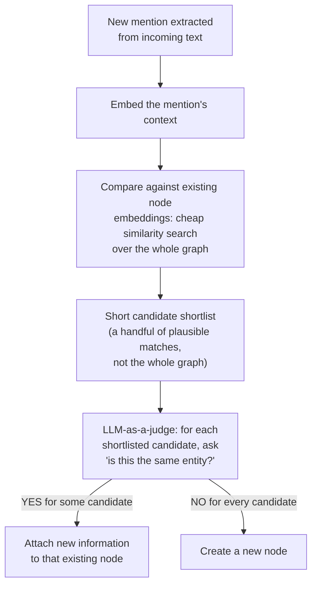

## Entity Resolution and Deduplication as the Systems Problem of Deciding Whether a New Mention Refers to an Existing Node

### A Database Analogy: Upsert Without a Primary Key

Anyone who has written an `UPSERT` — insert if the row doesn't exist, update if it does — already knows this operation requires a primary key or a unique constraint to check against. `INSERT INTO customers (email, name) VALUES (...) ON CONFLICT (email) DO UPDATE ...` works cleanly because `email` is treated as a stable, unambiguous identifier: two rows with the same email are, by database-enforced fiat, the same customer. Entity resolution is what happens when you are forced to do the equivalent of an upsert *without* a reliable unique key to conflict on — when the only information available about whether a new record refers to something already stored is the record's own content, expressed in messy, variable natural language, with no guaranteed unique identifier anywhere in sight. "Dr. Maria Santos," "M. Santos, MD," and "the attending physician, Maria S." might all refer to the same person, or might not, and nothing in the data format itself settles the question the way a shared `email` column would.

This is the systems problem this item names precisely: entity resolution, sometimes called record linkage or deduplication depending on the subfield, is the general task of deciding whether two differently-worded mentions denote the same real-world entity. In the context of a knowledge graph being built incrementally, it takes on a specific and unavoidable shape: every time a new mention is extracted from incoming text, the pipeline must decide whether that mention refers to a node that already exists in the graph, or whether it names a genuinely new entity that needs a new node.

### Stating the Decision Precisely

For each newly extracted mention $m$, the pipeline faces a decision between exactly two outcomes: either $m$ refers to some existing node $v$ already present in the graph, in which case the correct action is to attach any new information carried by $m$ onto $v$ rather than creating a duplicate; or $m$ refers to a genuinely new entity not yet represented anywhere in the graph, in which case the correct action is to create a new node. Framed this way, entity resolution is fundamentally a **binary classification problem, repeated once per incoming mention, against a growing and dynamically changing set of candidates** — the existing graph itself — rather than against a fixed, known set of classes decided in advance. This last detail is what makes it structurally unlike a conventional classification task: the set of possible "classes" (existing nodes) is not fixed ahead of time, grows with every accepted insertion, and the correct answer for any given mention depends on the current state of a graph that a moment ago might not have contained the node that mention should now match.

### Why This Cannot Be Solved by String Matching Alone

The most naive approach — treat two mentions as the same entity if their text matches exactly, or matches after some light normalization like lowercasing and trimming whitespace — fails in both directions immediately, and it is worth being concrete about both failure directions because a real pipeline has to guard against each independently.

**False negatives from surface variation.** The same real-world entity is routinely referred to using entirely different surface strings: "IBM" and "International Business Machines," "NYC" and "New York City," "Dr. Maria Santos" and "M. Santos." No exact-match or simple-normalization rule links these pairs, because the strings genuinely differ at the character level, sometimes substantially. A pipeline relying purely on string equality would create a separate, duplicate node for every one of these variant phrasings, fragmenting what should be a single entity's information across several disconnected nodes.

**False positives from surface coincidence.** Conversely, two genuinely different real-world entities can share identical or near-identical surface text. Two different people can both be named "John Smith." Two different organizations, in different cities, can both be called "Central Hospital." A pipeline relying purely on string equality would incorrectly merge these into a single node, conflating two distinct entities' information under one identity.

Both of these failure directions demonstrate that the actual decision being made is not about the *strings themselves* but about what those strings are being used to *refer to* — a semantic question about real-world reference, not a syntactic question about character sequences. This is precisely why entity resolution, as a task, requires tools capable of reasoning about meaning rather than tools that only compare surface form.

### A Worked Example Tracing the Decision

Consider a pipeline processing a stream of documents about municipal government, encountering the following mentions in sequence:

1. "the City Health Office announced a new vaccination drive"
2. "Dr. Elena Reyes, head of the City Health Office, confirmed the timeline"
3. "the Municipal Health Department released updated guidelines"
4. "CHO officials met with representatives from the regional hospital"

| Mention | Candidate match against existing graph | Resolution decision | Reasoning |
| --- | --- | --- | --- |
| 1. "City Health Office" | No existing node | Create new node $v_1$ | First mention; nothing to compare against yet |
| 2. "the City Health Office" | Exact string match to $v_1$ | Resolve to $v_1$ | Trivial case, string match suffices, but note this only worked by coincidence of exact phrasing |
| 3. "the Municipal Health Department" | No exact string match to $v_1$; semantically plausible match | Resolve to $v_1$ (if judged same entity) or create $v_2$ (if judged different) | Requires a semantic judgment — recall that a subsumption or equivalence question like this is exactly the kind of relational question an LLM-as-a-judge step, rather than a fixed string comparison, is suited to answer |
| 4. "CHO" | No exact string match; requires recognizing an acronym | Resolve to $v_1$ if the acronym is correctly expanded and matched | A different failure mode again: abbreviation resolution, requiring world knowledge about what "CHO" plausibly stands for in this context |

This small trace illustrates that even within a single short document stream, entity resolution decisions are not uniform in difficulty or in the kind of reasoning they require: mention 2 is trivial, mention 3 requires a genuine semantic-equivalence judgment of exactly the kind discussed when introducing LLM-as-a-judge as distinct from a similarity score, and mention 4 requires yet another kind of world knowledge (acronym expansion) that a pure similarity score has no privileged access to either.

### Recalling the Tools Available to Make This Decision

Entity resolution is precisely the systems problem that the tools built up across this curriculum's earlier chapters exist to solve, and this item is best understood as naming the problem those tools are jointly aimed at, rather than introducing a new mechanism of its own. Recall that an embedding similarity score can compare the vector representation of a new mention's context against the vector representations of existing nodes cheaply, at scale, producing a ranked shortlist of plausible candidate matches out of what could be a very large existing graph — exactly the kind of coarse, cheap first-pass filtering a similarity score is well suited for, and poorly suited for anything beyond. Recall separately that an LLM-as-a-judge step, posed as a direct relational question — "does this mention and this existing node's description refer to the same real-world entity?" — can render the finer, semantically loaded verdict that a similarity score cannot, precisely because that verdict may need to be asymmetric, context-dependent, or grounded in world knowledge no fixed geometric formula has access to.

This two-stage shape — cheap similarity filtering to narrow a large graph down to a small shortlist, followed by an expensive but semantically capable LLM judgment to make the final call among that shortlist — is the standard architectural response to entity resolution's dual requirement: it must scale to a graph with many existing nodes (ruling out running an expensive LLM judgment against every single one), and it must get the final decision right on genuinely ambiguous cases that a similarity score alone cannot resolve (ruling out relying on the cheap filter as the final word).

### Why Getting This Decision Wrong Is Costly in Both Directions

An entity resolution error is not a single failure type but two distinct ones, each with its own downstream cost, mirroring the two failure directions of naive string matching but now at the level of the whole pipeline's decision quality rather than just its string-comparison logic. Resolving a mention to the wrong existing node, or merging two genuinely distinct entities into one, corrupts that node's information going forward — every subsequent piece of information about either original entity gets attributed to a single conflated node, and untangling that conflation after the fact requires recognizing that a merge error occurred at all, which nothing about the merged node's structure signals on its own. Failing to resolve a mention that should have matched an existing node, and instead creating a spurious duplicate, fragments a single real-world entity's information across multiple disconnected nodes, degrading the graph's usefulness for any query that expects a given entity's information to live in one place — a query asking "what has been said about the City Health Office" silently misses everything attributed to a duplicate node called "Municipal Health Department" if that duplicate was never merged back.

### Positioning This Problem Within the Incremental Construction Process

This item deliberately isolates entity resolution as a standalone systems problem — deciding node identity — separate from the placement problem this chapter's earlier chapters were concerned with: once a mention has been correctly resolved to a *new* node rather than an existing one, deciding *where in the category hierarchy* that new node belongs is a further, separate decision, involving subsumption judgments of the kind traced across the Healthcare Facilities example. A complete incremental graph-construction pipeline must solve both problems for every new mention it processes: first, does this refer to something already in the graph (entity resolution, this item's concern); and only if the answer is no, where in the existing structure does this genuinely new entity belong (categorical placement, this chapter's next concern). Treating these as the same decision, or solving one while neglecting the other, is a common source of a graph that is simultaneously fragmented by duplicate nodes and poorly organized by category — two independent failure modes that happen to often be discussed together because they arise at the same moment in the pipeline, on the same incoming mention.

**Related Topics**

- Two-stage embedding-plus-LLM decision pipelines as the standard architectural pattern for entity resolution at scale
- Graph drift under streaming updates, including duplicate-node accumulation as one specific drift pattern
- The generator-verifier-pruner architectural pattern, including a pruning step that can retroactively merge detected duplicates
- Categorical placement of a genuinely new node once entity resolution has ruled out an existing match
- A fully worked small insertion example applying entity resolution together with every other tool from this curriculum
- Acronym and alias resolution as a specific recurring sub-problem within entity resolution