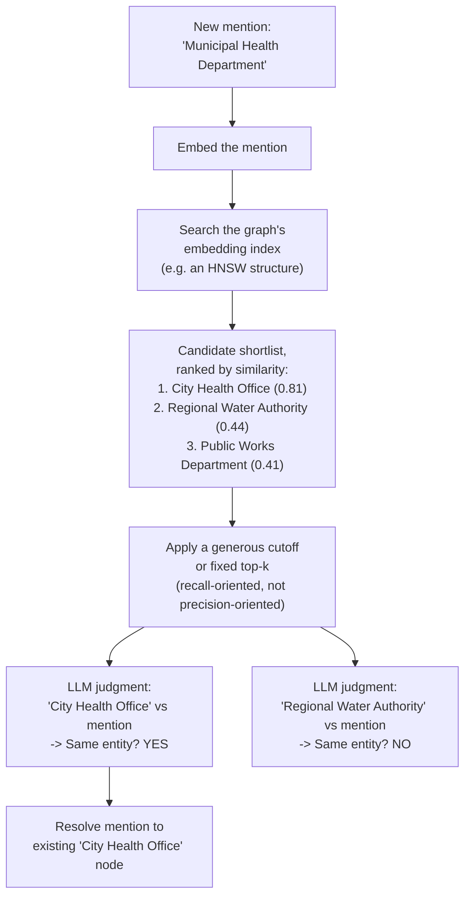

## Combining an Embedding-Similarity Prefilter with an LLM Judgment as a Two-Stage Decision Pipeline, and Why Each Stage Covers the Other's Weaknesses

### A Database Analogy: The Index Scan Before the Predicate Check

A query planner facing a `WHERE` clause with an expensive predicate — a user-defined function, a regex match, an external lookup — does not apply that expensive predicate to every row in a large table. It first uses a cheap index scan to narrow the table down to a small candidate set of rows that could plausibly satisfy the predicate, and only then runs the expensive check against that much smaller set. The index scan is fast but coarse: it uses a cheap, approximate criterion (an indexed column's value) as a stand-in for the real condition the query actually cares about, and it can pass through some rows that will ultimately fail the expensive check. The expensive predicate is slow but precise: it is capable of evaluating the actual condition correctly, but running it against the entire table would be prohibitively costly. Neither stage alone is both cheap and correct; the two-stage combination is.

This is exactly the shape of the architecture this item names for entity resolution and categorical placement in an incrementally built knowledge graph: an embedding-similarity prefilter plays the role of the cheap, coarse index scan, and an LLM judgment plays the role of the slow, precise predicate check. Neither stage is redundant with the other, and understanding why requires being precise about which specific weakness of each stage the other stage is structurally positioned to cover.

### Recalling Each Stage's Individual Character

Recall that an embedding similarity score is the output of a fixed geometric formula applied to two static vectors — a dot product, a normalization, an angle — and that this computation is cheap enough to run at scale, symmetric by construction, and entirely without access to world knowledge or relational reasoning beyond whatever proximity structure the embedding function happened to encode. Recall separately that an LLM judgment is the output of a generative reasoning process, conditioned on a specific prompt, capable of rendering asymmetric, categorical, and world-knowledge-informed verdicts — at the cost of being far more computationally expensive per comparison than evaluating a fixed formula, and at the cost of the instability and chain-composition risks traced through the Healthcare Facilities example.

### Stage One: Why the Similarity Prefilter Is Necessary

Consider the scale at which entity resolution actually operates in an incrementally growing graph. Recall that entity resolution frames each new mention as a decision against the entire existing graph: does this mention match any of the nodes already present. If the graph has accumulated many thousands of nodes over the course of incremental construction, checking a new mention against every single existing node using an LLM judgment would require issuing one expensive generative call per existing node, for every single incoming mention — a cost that grows linearly with the current size of the graph, for every insertion. This is precisely the kind of per-insertion cost that grows with existing structure size that the earlier discussion of the cost of growing a structure identified as the shape to avoid; running a full LLM-judgment sweep against the entire graph on every insertion is, cost-wise, no better than the brute-force linear scan already shown not to scale.

The similarity prefilter exists specifically to prevent this. Because a similarity score is cheap to compute and, when computed over vectors stored in an appropriately indexed structure, can be evaluated approximately in sub-linear time — recall the discussion of approximate nearest-neighbor search and structures like HNSW that make exactly this kind of large-scale proximity search practical — the prefilter stage can take a new mention and, out of a graph with many existing nodes, cheaply produce a short candidate list: perhaps the ten or twenty nodes whose embeddings sit closest to the new mention's embedding, discarding the vast majority of the graph as obviously irrelevant without ever invoking an expensive LLM call on any of it.

### Stage Two: Why the Similarity Prefilter Alone Is Not Sufficient

Having narrowed the field to a short candidate list, the pipeline cannot simply take the top-ranked candidate by similarity score and declare a match, for exactly the reasons catalogued when distinguishing LLM-as-a-judge from a similarity score. A similarity score is symmetric and has no access to the asymmetric, categorical, world-knowledge-dependent structure of the actual question being asked — is this new mention the *same real-world entity* as this candidate, not merely *topically close* to it. Recall the worked illustration where "City Health Office" and "Health Insurance Office" could land at a similarity score numerically comparable to the score between "City Health Office" and "Municipal Health Department," despite the first pair being unrelated offices and the second pair being genuine synonyms — a fixed geometric formula cannot, on its own, tell these two situations apart, because both pairs may simply share enough contextual vocabulary to produce a similar numeric proximity, for reasons that have nothing to do with whether they denote the same entity.

This is precisely the gap the second stage is positioned to close. For each of the small number of candidates the similarity prefilter surfaced, the pipeline poses a direct relational question to an LLM: "does this new mention refer to the same real-world entity as this existing node?" Because this question is now being asked about only a handful of candidates rather than the entire graph, the expensive cost of an LLM judgment is incurred a small, bounded number of times per insertion, rather than once per existing node — and because the question is a genuine relational judgment rather than a distance measurement, it can correctly separate the true match from the merely-topically-similar near-misses that the prefilter, by design, could not distinguish.

### The Precise Division of Labor: Each Stage Covers a Named Weakness of the Other

Stating this as a table makes the complementary structure explicit, because the two stages are not simply "one cheap, one accurate" — each one is specifically weak exactly where the other is specifically strong:

| Dimension | Embedding-similarity prefilter | LLM judgment |
| --- | --- | --- |
| Cost per comparison | Cheap; scales to comparing against a large existing graph | Expensive; only affordable against a small candidate set |
| Coverage of the graph | Can cheaply scan the entire graph via an indexed structure | Cannot afford to be run against the entire graph |
| Handling of directionality | Structurally symmetric; cannot represent an asymmetric relation | Can render an asymmetric, directional verdict when the question calls for one |
| Semantic precision | Reports proximity, which can be coincidental (shared vocabulary, shared topic) | Can distinguish true identity or entailment from mere topical overlap |
| Reliability of output | Deterministic; the same two vectors always produce the same score | Potentially unstable across rephrasing, as noted when comparing failure modes |
| Role in the pipeline | Recall (catching every plausible candidate cheaply) | Precision (correctly deciding among the plausible candidates) |

The bottom row is the crux of the complementarity: the prefilter's job is to maximize **recall** — make sure the true match, if one exists anywhere in the graph, ends up somewhere in the shortlist, even at the cost of including some irrelevant candidates alongside it — while the LLM judgment's job is to maximize **precision** among that shortlist — correctly reject the irrelevant candidates the prefilter could not distinguish, and correctly confirm the true match if it is present. Neither stage is asked to do the job the other stage is suited for: the prefilter is never asked to render a final semantic verdict, and the LLM judgment is never asked to scan the whole graph.

### A Worked Trace Through Both Stages

Return to the mention "the Municipal Health Department released updated guidelines" arriving into a graph that already contains a node for "City Health Office," among many other unrelated nodes accumulated over the course of incremental construction.

[Speculation] The specific similarity figures shown are illustrative rather than measured, but the pattern they represent is realistic: the true match, "City Health Office," surfaces at a noticeably higher similarity score than the unrelated candidates, which is exactly what makes the prefilter stage effective at its assigned job of recall — it does not need to perfectly distinguish the true match from every other node with certainty, it only needs to ensure the true match is *somewhere* near the top of a short list, leaving the harder job of certainty to the second stage. Note that the prefilter's cutoff is deliberately set to be generous rather than tight — pulling in three candidates rather than attempting to output only the single best one — precisely because tightening the cutoff to output only the top candidate directly would reintroduce the prefilter's core weakness: if the true match ever ranks second by coincidental embedding proximity rather than first, an overly strict cutoff would silently discard it before the LLM judgment ever gets a chance to correctly identify it.

### Why the Combination, and Not Either Stage Alone, Is the Standard Pattern

Neither stage substitutes for the other, and this is worth stating as a direct consequence of the two stages' fundamentally different mechanisms rather than as a matter of one simply being a more refined version of the other. Recall that a similarity score and an LLM judgment are computed by structurally different processes answering structurally different questions — one measuring geometric proximity via a fixed formula, the other rendering a relational verdict via generative reasoning — and recall from comparing their failure modes that these differences are differences in kind, not degree. A pipeline that used only the prefilter would inherit every one of the similarity score's structural blind spots directly into its entity-resolution decisions, silently merging or separating entities based on coincidental vocabulary overlap. A pipeline that used only the LLM judgment, applied exhaustively against the whole graph, would inherit a per-insertion cost that grows with the size of the existing structure, undermining the very scalability goals motivating the search for better-than-brute-force insertion strategies in the first place. The two-stage combination is the standard architecture precisely because it is the minimal design that avoids both of these named failure modes simultaneously, at a cost profile — cheap broad search plus a small, bounded number of expensive precise checks — that neither stage could achieve alone.

**Related Topics**

- Approximate nearest-neighbor search and HNSW as the concrete indexing technology making the prefilter stage scale to a large graph
- Setting the prefilter's candidate-list size or cutoff as a recall-versus-cost trade-off
- Entity resolution and deduplication as the specific systems problem this two-stage pipeline is most directly built to solve
- The generator-verifier-pruner architectural pattern as a related multi-stage design applied to graph maintenance more broadly
- Failure modes of the LLM judgment stage, including chain inconsistency, that persist even after a well-designed prefilter
- A fully worked small insertion example combining this two-stage pipeline with every other tool from this curriculum