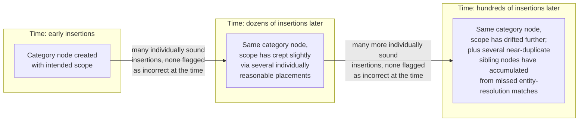

## What Graph Drift Means Under a Stream of Ongoing Updates, and Why a Graph's Structure Can Degrade Even When Every Individual Update Looks Correct

### A Systems Analogy: Filesystem Fragmentation

A filesystem does not need a single bad write to end up in poor shape. Every individual file creation, deletion, and resize operation can execute perfectly correctly, obeying every rule the filesystem's allocator was designed to enforce, and yet, purely as an emergent consequence of thousands of individually correct operations happening in sequence, the disk ends up with files scattered across non-contiguous blocks, free space chopped into small unusable fragments, and read performance measurably worse than it would be on a freshly formatted disk holding the identical set of files. Nobody made a mistake. The degradation is not a bug in any single operation; it is a structural property that accumulates *across* a long sequence of individually valid operations, invisible if you only ever inspect one operation at a time, and fully visible only when you step back and look at the aggregate shape of the whole disk.

Graph drift is the same phenomenon, transplanted onto a knowledge graph being built incrementally, one mention at a time, over an extended stream of ongoing updates. This item names the phenomenon precisely and distinguishes it clearly from the discrete, locatable failure modes catalogued elsewhere in this chapter's neighboring items.

### Defining Graph Drift

Graph drift is the gradual, cumulative degradation of a graph's overall structural quality — its correctness, its navigability, its faithfulness to the real-world domain it represents — as a consequence of a long sequence of individual insertion, resolution, and placement decisions, even when every one of those individual decisions was locally reasonable given the information available to it at the time it was made. The defining feature that separates drift from a conventional bug is this: there is no single update anywhere in the sequence that a reviewer, inspecting it in isolation with the same information the pipeline had at that moment, would flag as clearly wrong. The problem exists only in the aggregate, accumulated shape of the graph, not in any individual decision that produced it.

This is structurally the same phenomenon named when discussing why transitivity is not automatically guaranteed just because each individual judgment seems locally reasonable, and when tracing what breaks downstream in a knowledge graph when a set of subsumption judgments is not transitive — but drift is the broader, chapter-level pattern of which that transitivity failure is one specific, fully worked instance. Recall that the Healthcare Facilities and Hospitals example showed two individually sound pairwise judgments composing into a false conclusion at a single point in the graph. Drift is what happens when that same basic mechanism — locally sound decisions failing to compose correctly — repeats, in different specific forms, across hundreds or thousands of insertions spread over an extended period of ongoing graph growth, none of which individually resembles the Healthcare Facilities case, but which collectively erode the graph's quality in ways no single insertion's review would have caught.

### Why "Every Individual Update Looks Correct" Is the Crux, Not an Exaggeration

It is worth taking seriously exactly how strong this claim is, because it is easy to underestimate. It is not that individual updates are usually correct and drift is what happens in the occasional case where one goes wrong. The claim is that a system can exhibit substantial drift while a review of *every single update in the sequence*, taken one at a time with the context available to it, finds nothing to object to in any of them. This is possible because "correct given the information available at that moment" is a strictly weaker condition than "correct with respect to the graph's ideal final structure," and the gap between those two conditions is exactly where drift lives.

Recall from entity resolution and deduplication that resolving a new mention against an existing node is a decision made against *the graph's current state* at the moment the mention arrives — a candidate shortlist is drawn from whatever nodes already exist, using whatever embeddings and category labels those nodes currently carry. If the graph's own state has itself already drifted somewhat by the time a new mention arrives — a category node's label has, say, gradually taken on a slightly different implicit scope than it originally had, through several earlier insertions each nudging its neighborhood slightly — then a new resolution decision made against that already-slightly-drifted state can be entirely correct *relative to the graph as it currently stands*, while still contributing to further drift relative to the graph's ideal, fully-corrected structure. Each decision is locally sound relative to its own immediate context; the immediate context itself is what has been quietly moving.

### Three Concrete Mechanisms That Produce Drift

Graph drift is not one single mechanism — it is a name for the aggregate outcome of several distinct, individually small effects compounding together. Three worth naming concretely:

**Duplicate accumulation from imperfect entity resolution.** Recall that entity resolution's two-stage prefilter-plus-judgment pipeline is designed to catch most true matches, but recall also that neither stage carries an unconditional correctness guarantee — the prefilter can occasionally rank a true match below its cutoff, and the LLM judgment stage inherits the instability-under-rephrasing risk noted when comparing failure modes. A small, low percentage of missed matches, occurring independently and unremarkably across a long stream of insertions, does not produce one dramatic failure — it produces a slow accumulation of near-duplicate nodes across the graph, each individually looking like a reasonable "this must be a new entity" decision at the moment it was made, collectively fragmenting what should be single, unified entities across several disconnected nodes by the time the graph has processed a large volume of updates.

**Category boundary creep from repeated placement decisions.** Each time a new entity is placed beneath an existing category node via a subsumption judgment, that judgment is made by an LLM reasoning fresh about the specific pairing in front of it — recall that an LLM judgment is generated conditioned on its specific prompt, with no persistent, symbolic definition of a category's boundary consulted identically every time. If a category node such as "Healthcare Facility" accumulates, over dozens of separate placement decisions made at different points in time, a slightly broader or narrower effective membership than its original intended scope — perhaps because several borderline cases were each, individually and defensibly, judged to fit — the category's *functional* boundary can gradually shift away from its original meaning, with no single placement decision responsible for the shift and no natural point at which anyone notices it happening.

**Compounding propagation beneath an already-imperfect ancestor.** Recall from what breaks downstream in a knowledge graph when subsumption is not transitive that a bad link, once present, becomes a foundation every subsequent insertion beneath it inherits automatically, without re-examination, precisely because trusting the ancestor chain by composition is what makes incremental insertion efficient in the first place. Over a long stream of updates, this propagation mechanism means that any drift introduced early in the graph's history has a longer window to keep compounding, silently, beneath every later insertion that happens to land in the affected region of the hierarchy — the earliest imperfections have the most time to spread.

### Why Drift Is Structurally Invisible to Per-Update Review

The mechanisms above share a common structural feature worth stating explicitly: each one operates through *repetition of a small, individually tolerable effect*, rather than through any single decisive error. A quality-control process that checks each update for correctness at the moment it is made — exactly the kind of check that a two-stage entity-resolution pipeline or a single subsumption judgment already performs — is, by construction, evaluating the update against the graph's *current* state and the *specific* information available about that one mention. It has no visibility into the slow trend across dozens of prior updates that produced the current state it is checking against, and no visibility into how this update will interact with dozens of future updates yet to come. Drift is, in this precise sense, a property of the *sequence*, detectable only by examining the graph's structure at two points separated by many updates and comparing them — not a property any single update, however carefully reviewed in isolation, could ever be expected to reveal.

### Distinguishing Drift from the Discrete Failures Named Elsewhere in This Chapter

It is worth being precise about how this item's scope differs from its closest neighbors, since the underlying mechanisms overlap. The Healthcare Facilities example and the general discussion of transitivity failure both concern a *single, locatable* composition of a small number of judgments producing one identifiable wrong conclusion, traceable to one specific point in the graph. Graph drift is the broader claim that this same basic failure shape — local soundness failing to guarantee global correctness — recurs continuously, in many small and individually forgettable instances, across an extended stream of updates, such that the graph's overall quality degrades measurably even though no single instance would be worth flagging as a notable failure on its own. One is a worked case study of the mechanism; the other is the name for what happens when that mechanism operates continuously, at low intensity, over a long operational lifetime rather than as an isolated incident.

### Why This Matters for a Pipeline's Long-Run Design

A pipeline evaluated only on its per-insertion decision quality — does each individual entity resolution or placement decision look correct given its immediate context — can pass every such evaluation with a high success rate while still producing a graph whose overall structural quality has measurably degraded after a long period of sustained operation, because per-insertion evaluation is structurally blind to exactly the kind of slow, cumulative effect drift represents. This is precisely the motivation for architectural responses that operate at a different timescale than individual insertion — mechanisms that periodically re-examine the graph's aggregate structure, rather than only ever checking each new update against its immediate local context, are the only kind of mechanism positioned to catch a problem that per-update review is, by its very nature, unable to see.

**Related Topics**

- The generator-verifier-pruner architectural pattern as a mechanism specifically designed to catch drift through periodic aggregate review rather than only per-update checks
- What breaks downstream in a knowledge graph when a set of subsumption judgments is not transitive, as one concrete, locatable mechanism contributing to drift
- Entity resolution and deduplication, and the imperfect match rates that feed duplicate accumulation over time
- A fully worked small insertion example tracing how drift-contributing decisions look reasonable at each individual step
- Amortized analysis and the aggregate method, as an analogous case where a sequence's total behavior differs from what any single operation reveals
- Monitoring and auditing strategies for detecting structural degradation in a graph that has been growing for an extended period