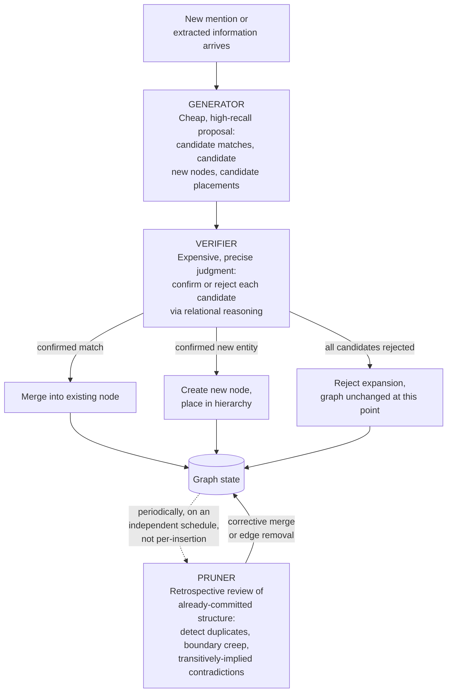

## Generator, Verifier, and Pruner as a Recurring Architectural Pattern for Deciding Whether to Expand, Merge, or Stop Growing a Graph at a Given Node

### A Systems Analogy: Compiler Passes That Never Trust Each Other's Output Blindly

A modern optimizing compiler does not perform a single pass that both proposes and finalizes every transformation. A typical pipeline separates concerns into distinct stages: one pass proposes candidate transformations — inline this function, unroll this loop, eliminate this dead branch — often somewhat aggressively, erring toward proposing more than will ultimately survive. A separate verification pass then checks each proposed transformation against the program's actual semantics, rejecting any that would change observable behavior. And a further pass prunes the result, removing code and structures that the now-verified transformations have rendered redundant or unreachable, keeping the final binary lean. No single pass is trusted to get everything right unilaterally; the pipeline's overall correctness and quality emerge from the specific division of labor across three passes, each checking or cleaning up after the one before it.

Generator, Verifier, and Pruner is the same three-stage division of labor, applied to the recurring decision a knowledge-graph construction pipeline must make at every point where the graph could grow: should a new node be added here, should this candidate be merged into something that already exists, or should this expansion be rejected and the graph left as it is. This pattern is not a new technique introduced from scratch — it is a structural naming of a division of labor implicit in several ideas already built up across this chapter, made explicit here because it recurs across every kind of growth decision this chapter is concerned with.

### The Three Roles, Defined Precisely

**The Generator's role is proposal, not final judgment.** Given a new mention or a new piece of extracted information, the generator's job is to produce candidate actions: candidate matches against existing nodes, candidate new nodes to create, candidate edges to add. Recall that an embedding-similarity prefilter, discussed when combining a similarity prefilter with an LLM judgment, plays exactly this generative role for entity resolution — it is deliberately tuned toward recall rather than precision, casting a wide enough net that the true correct action, if one exists, is very likely somewhere among its candidates, even at the cost of including several candidates that will not survive further scrutiny. A generator that is too conservative, proposing only what it is highly confident about, risks missing the correct action entirely; the architecture is specifically designed to tolerate a generator that over-proposes, because a separate stage exists downstream to filter what it proposes.

**The Verifier's role is precise, effortful confirmation or rejection of each candidate.** Where the generator is cheap and permissive, the verifier is expensive and exacting: it takes each candidate the generator proposed and subjects it to a rigorous check before it is allowed to actually change the graph. Recall that an LLM-as-a-judge step, posed as a direct relational question, plays exactly this role in the two-stage entity-resolution pipeline — it is the stage capable of distinguishing a true entity match from a merely topically similar near-miss that the generator's cheap proximity search could not tell apart. The verifier's defining property is that it is trusted to make the actual accept-or-reject decision precisely because it has access to reasoning capabilities — asymmetric, categorical, world-knowledge-grounded judgment — that the generator's cheap mechanism structurally lacks.

**The Pruner's role is retrospective cleanup that neither the generator nor the verifier is positioned to perform at the moment of a single insertion.** This is the role that distinguishes the full three-part pattern from the two-stage generator-verifier pipeline already introduced for entity resolution. Recall that graph drift is, by its very nature, a property of an extended sequence of updates rather than any single update — invisible to any check performed at the moment one insertion happens, because such a check only has visibility into that one insertion's immediate context. The pruner operates on a different timescale and with a different scope than the generator or verifier: rather than evaluating one candidate action against the graph's current state, it periodically re-examines a region of the graph's *already-committed* structure, looking for exactly the kind of slow, compounding degradation — duplicate nodes that entity resolution missed, category boundaries that have crept, transitively-implied contradictions of the kind traced through the Healthcare Facilities example — that only becomes visible in aggregate, after enough updates have accumulated for the pattern to show itself.

### Why Three Roles, Not Two

It would be reasonable to ask why the generator-verifier pair, already sufficient to handle a single entity-resolution decision correctly, needs a third stage at all. The answer is that generator and verifier, however well designed, are both scoped to a *single incoming decision*, evaluated against the graph as it currently stands at that moment. Recall the precise mechanism behind graph drift: a decision can be entirely correct relative to the graph's current state while still contributing to degradation relative to the graph's ideal structure, because the graph's own current state may already carry accumulated imperfection that neither the generator nor the verifier, looking only at the one mention in front of them, has any way to detect. A verifier asked "does this new mention match this existing node" has no mechanism for separately asking "and is this existing node itself, independent of the new mention, still correctly distinguished from its near-duplicate sibling created three hundred insertions ago." That second question requires a process that looks backward across the graph's accumulated history rather than forward at one incoming candidate — which is precisely the pruner's job, and precisely why it needs to exist as a genuinely separate stage rather than as an extra responsibility folded into the verifier.

The dotted arrow into the Pruner is deliberate: unlike the solid arrows tracing a single insertion's path through the generator and verifier, the pruner's activation is not triggered by any one incoming mention. It runs on its own schedule or trigger condition, examining the graph's accumulated state rather than reacting to a specific new piece of information.

### A Worked Trace Through All Three Stages

Return to the running example from entity resolution: a graph that has, over an extended period of incremental construction, accumulated both a "City Health Office" node and — because an earlier entity-resolution decision happened to miss the match, exactly the kind of low-probability but nonzero-rate failure noted when discussing graph drift — a separate, unmerged "Municipal Health Department" node that should have been resolved to the same entity from the start.

**Generator, at the moment "CHO officials" is mentioned in new text:** produces a candidate shortlist via similarity search: "City Health Office" (high similarity), "Municipal Health Department" (moderate similarity, since it is a genuine synonym but the embedding did not rank it as the closest match), and a few unrelated low-similarity candidates.

**Verifier, evaluating the shortlist:** correctly judges "CHO" as an abbreviation resolving to "City Health Office," and resolves this new mention to that existing node. This is the correct decision *for this one mention*, made correctly, with the information available. Note explicitly what the verifier did *not* do: it was never asked to check whether "City Health Office" and "Municipal Health Department" — two nodes that already existed in the graph before this mention ever arrived — should themselves be merged. That question was outside the scope of the decision it was asked to make.

**Pruner, running later on its own independent schedule:** performs a retrospective sweep over a region of the graph, comparing pairs of existing nodes with high similarity or overlapping category placement — not new mentions being resolved, but nodes already sitting in the graph — and surfaces "City Health Office" and "Municipal Health Department" as a suspiciously close pair worth a fresh verification pass. Running the same kind of LLM-as-a-judge check the entity-resolution verifier would have run, but now applied retrospectively between two committed nodes rather than between a new mention and an existing node, the pruner confirms they denote the same entity and merges them, consolidating whatever information had been separately attached to each over the intervening period.

This trace makes the division of labor concrete: the generator and verifier, doing their jobs correctly, still let this specific duplication through, because the duplication was never information available to either of them at the moment the original missed match occurred — it only became visible once a separate process specifically went looking for exactly this pattern across the graph's existing structure.

### Applying the Same Three Roles Beyond Entity Resolution

The pattern is described here in terms of entity resolution because that is where its three roles map most directly onto machinery already introduced, but the same three-part shape applies to categorical placement decisions as well. A generator can propose candidate parent categories for a new node using cheap similarity search over category labels; a verifier can render the actual subsumption judgment for each candidate parent, exactly as traced through the earlier Hospital and Healthcare Facility example; and a pruner can periodically re-examine already-committed subsumption chains for exactly the kind of transitively-implied contradiction the Healthcare Facilities and Hospitals case demonstrated — checking, after the fact and across a whole region of the hierarchy, whether composed multi-hop conclusions still hold up against a direct, independent judgment, catching the specific kind of silent structural error that recall showed neither the generator nor the verifier, each scoped to a single insertion, could have caught at the time it was introduced.

### Why This Pattern Recurs Rather Than Being Solved Once

The reason this three-part division is worth naming as a general, recurring architectural pattern, rather than as a one-off design specific to entity resolution, is that its underlying justification is fully general: any decision process built from a cheap, high-recall proposal stage and an expensive, precise confirmation stage will, for exactly the reasons drift demonstrates, still permit slow, compounding degradation across a long sequence of individually correct decisions, unless a genuinely separate retrospective process exists to examine the accumulated structure those decisions produced. The generator and verifier solve the problem of making each individual decision well; the pruner solves the different problem of keeping the aggregate structure those decisions collectively produce faithful to what it should be, over a timescale no single decision was ever positioned to examine.

**Related Topics**

- Two-stage embedding-plus-LLM decision pipelines as the generator-verifier core of this pattern applied specifically to entity resolution
- Graph drift under streaming updates as the specific phenomenon the pruner stage exists to catch
- What breaks downstream in a knowledge graph when a set of subsumption judgments is not transitive, as one concrete target of retrospective pruning
- A fully worked small insertion example applying the full generator-verifier-pruner pattern end to end
- Scheduling and triggering strategies for when a pruner pass should run relative to ongoing insertions
- SAC-KG's Generator-Verifier-Pruner architecture as a specific published mechanism this pattern is named after