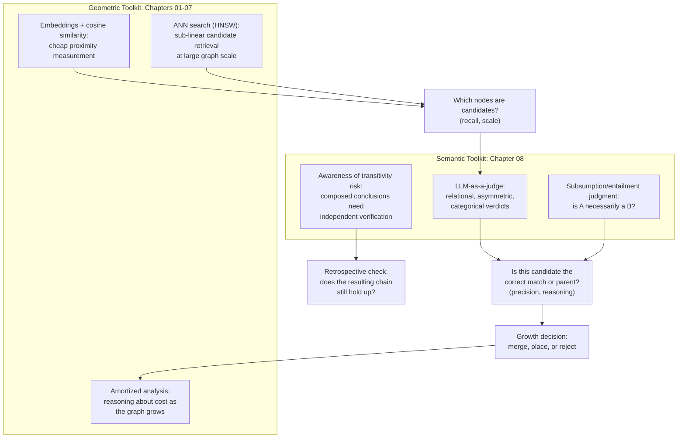

## Why Growth Decisions in a Knowledge Graph Are a Mix of the Geometric Tools from Earlier Chapters and the Semantic Judgment Tools from Chapter 08

### A Systems Analogy: A Query Optimizer That Needs Both Statistics and Semantics

A database query optimizer deciding how to execute a join needs two genuinely different kinds of information, produced by two genuinely different kinds of machinery. It needs numeric statistics — table cardinalities, index selectivity estimates, histogram-based row-count predictions — to decide *which* join strategy is cheapest given the data's rough shape. And separately, it needs to correctly interpret the query's actual semantics — what the `JOIN ... ON` predicate means, whether a `NULL` should be treated as matching or non-matching, whether an outer join's semantics are being requested — to decide what the *correct* result even is in the first place. Neither kind of information substitutes for the other: the numeric statistics tell you nothing about correctness, and the semantic interpretation tells you nothing about cost. A working optimizer needs both, applied to different sub-questions within the same overall decision.

This item's claim is that every growth decision in an incrementally built knowledge graph — deciding whether to merge a new mention into an existing node, where to place a genuinely new node in the category hierarchy, whether to trust a chain of ancestor relationships — is, in exactly this same sense, a decision that draws on two structurally different toolkits: the geometric, vector-space machinery built up across this curriculum's earlier chapters, and the language-based, relational judgment machinery introduced in Chapter 08. Neither toolkit alone is sufficient for the full decision, and this item's purpose is to make explicit exactly which sub-question each toolkit is responsible for.

### Recalling the Geometric Toolkit

The geometric toolkit spans several chapters, each contributing a specific capability, all of which share the common property of operating on vectors through fixed mathematical formulas rather than through generated language. Recall that an embedding function maps a piece of text to a vector engineered so that proximity in that vector space corresponds to semantic similarity, and that cosine similarity measures the angle between two such vectors while ignoring their magnitude, giving a single scalar measure of proximity. Recall that exact nearest-neighbor search, evaluated via brute-force linear scan, provides an honest but linearly-scaling baseline for finding the closest existing vectors to a new one, and that approximate nearest-neighbor structures such as HNSW make this search practical at scale by trading a small amount of accuracy for a large reduction in query cost, using a layered, navigable graph structure and greedy routing rather than exhaustively comparing against every stored vector. Recall further that amortized analysis, and the classical incremental data structures built from it, supply the vocabulary and proof techniques for reasoning rigorously about how an insertion strategy's cost behaves as the structure it inserts into grows larger — the cost-of-growth lens this curriculum applied directly to graph insertion strategies when comparing brute-force, threshold-based, and ANN-index-based approaches.

Everything in this toolkit shares one defining property: it operates on numbers, derived once by a fixed, non-reasoning process, and every downstream computation over those numbers — a similarity score, a nearest-neighbor query, a cost bound — is itself a fixed, deterministic formula or proof, entirely insensitive to what the underlying text actually *means* beyond however that meaning was encoded into the vector at embedding time.

### Recalling the Semantic Judgment Toolkit

The semantic judgment toolkit, introduced across Chapter 08, is built from a different underlying mechanism entirely. Recall that an LLM-as-a-judge process is a generative reasoning process, conditioned on a specific prompt, producing a language-rendered verdict rather than a numeric distance — capable, as a direct consequence of this different mechanism, of representing asymmetric relations such as subsumption, where every instance of a specific concept is necessarily an instance of a more general one but not the reverse, in a way a symmetric geometric formula structurally cannot. Recall also, from the Healthcare Facilities and Hospitals worked example, that this toolkit brings its own distinctive risk profile: individually sound relational judgments can compose, via transitivity, into a false multi-hop conclusion, because each judgment is generated fresh, with no persistent, symbolic definition anchoring an ambiguous term's sense consistently across every occurrence.

Everything in this toolkit shares the complementary defining property: it operates on language, reasoning about relational and categorical structure that a fixed formula has no access to, at the cost of being expensive to run at scale and carrying the instability and composition risks that came from being a generative rather than deterministic process.

### Mapping Each Toolkit to the Sub-Questions It Actually Answers

The mixing is not arbitrary or interchangeable — each growth decision this chapter has examined decomposes into sub-questions, and each sub-question has a toolkit that is structurally suited to it and a toolkit that is structurally unsuited to it, for reasons already established individually across earlier items.

**"Which small set of existing nodes could plausibly be relevant to this new mention, out of a graph that may contain many thousands of nodes?"** This is a scale and recall problem: the answer needs to be produced cheaply, across a large existing structure, without requiring an expensive computation against every node. Recall that this is exactly the role assigned to the embedding-similarity prefilter when combining a similarity prefilter with an LLM judgment — a geometric-toolkit tool, chosen specifically because it can be evaluated cheaply at scale via an approximate nearest-neighbor index, and specifically *not* assigned to the semantic toolkit, because running an LLM judgment against every existing node would reintroduce exactly the per-insertion cost that grows with existing structure size that this curriculum's cost-of-growth analysis identified as the shape to avoid.

**"Does this new mention actually refer to the same real-world entity as this specific candidate, or is the apparent closeness coincidental?"** This is a precision problem requiring relational, world-knowledge-grounded reasoning: recall the worked illustration where "City Health Office" and "Health Insurance Office" could produce a similarity score numerically comparable to a genuine synonym pair, despite denoting unrelated institutions — a distinction a fixed geometric formula cannot draw, because it has no access to what the underlying institutions actually are. This sub-question is assigned to the semantic-judgment toolkit specifically because it requires exactly the reasoning capability the geometric toolkit was shown to lack.

**"Where in the category hierarchy does a genuinely new entity belong?"** This decomposes further into the same two-part split. A geometric similarity search can cheaply propose a shortlist of plausible parent categories out of a large existing hierarchy — the same recall-oriented generator role. But the actual subsumption judgment — is every instance of this new entity necessarily an instance of this candidate parent category — is an inherently asymmetric, categorical question that recall showed a symmetric similarity score cannot represent correctly even in principle, and is therefore assigned to the semantic toolkit.

**"Is this multi-hop ancestor chain actually trustworthy, or has it silently drifted?"** Recall that transitivity's formal guarantee holds automatically in the clean mathematical case of strict subset containment, but recall from the Healthcare Facilities example that a chain of LLM-rendered judgments does not inherit this guarantee automatically. Checking whether a specific composed conclusion actually holds requires posing that composed conclusion directly to the semantic toolkit as an independent judgment — there is no equivalent geometric check, because the composition being verified is a chain of categorical, asymmetric relations, not a numeric proximity.

**"How much is this insertion strategy going to cost as the graph continues to grow?"** This sub-question, by contrast, belongs entirely to the geometric-and-amortization side of the toolkit — recall that amortized analysis and the classical incremental data structures supply the proof techniques for reasoning about growth cost, and that this reasoning applies regardless of whether the specific decision being costed out is a similarity lookup or an LLM judgment call; the *cost* of a semantic judgment is itself measured and reasoned about using the geometric-and-amortization toolkit's vocabulary, even though the judgment's *content* is produced by the semantic toolkit.

### Why Neither Toolkit Could Be Dropped in Favor of the Other

It is worth stating directly why this is a genuine mixture rather than a preference for one toolkit that happens to occasionally borrow from the other. A pipeline built entirely from the geometric toolkit — similarity scores and thresholds alone, with no semantic judgment stage — was shown, in the comparison of failure modes between a numeric threshold and an LLM judgment, to be structurally incapable of correctly handling asymmetric relations at all, no matter how well its threshold is calibrated; this is not a fixable weakness within the geometric toolkit, it is an absence of a capability that toolkit was never built to have. Conversely, a pipeline built entirely from the semantic toolkit — LLM judgments against every existing node, with no cheap geometric prefilter — was shown, when discussing the two-stage pipeline's necessity, to reintroduce exactly the per-insertion cost that grows linearly with the size of the existing structure, undermining the sub-linear scaling that was the entire point of preferring an ANN-index-based approach over brute-force insertion in the first place. Each toolkit is missing a capability the other supplies, and the missing capability is not a minor gap — it is the specific thing that toolkit's underlying mechanism structurally cannot produce.

### The Broader Pattern This Chapter Has Been Building Toward

Every architectural pattern introduced across this chapter — the two-stage prefilter-plus-judgment pipeline for entity resolution, the generator-verifier-pruner pattern for growth decisions more broadly — is, examined closely, a specific instance of this same underlying mixture: a cheap, scale-tolerant geometric stage narrowing a large space of possibilities down to a small candidate set, followed by an expensive, semantically capable judgment stage making the actual relational decision within that narrowed set, with the geometric toolkit's amortized-cost reasoning used throughout to keep the overall growth process from becoming the linear-cost problem this curriculum's Chapter 07 was specifically concerned with avoiding. Recognizing this as one recurring pattern, rather than as several unrelated architectural choices, is what this item's framing is meant to make explicit: a knowledge-graph growth decision is never purely a geometric computation and never purely a semantic judgment, because the decision itself is composed of sub-questions that genuinely differ in kind, and each toolkit this curriculum has built was constructed, chapter by chapter, specifically to answer one of those kinds and not the other.

**Related Topics**
- Two-stage embedding-plus-LLM decision pipelines as the concrete architectural instance of this mixture
- Generator, verifier, and pruner as a recurring architectural pattern built from the same two-toolkit division
- The cost of growing a structure, fusing the vector track and the amortization track, as the chapter establishing the geometric side's cost vocabulary
- Comparing the failure modes of a numeric similarity threshold against an LLM judgment, as the basis for why neither toolkit substitutes for the other
- A fully worked small insertion example applying both toolkits together end to end
- The capstone chapter's synthesis connecting this two-toolkit mixture to five specific published mechanisms