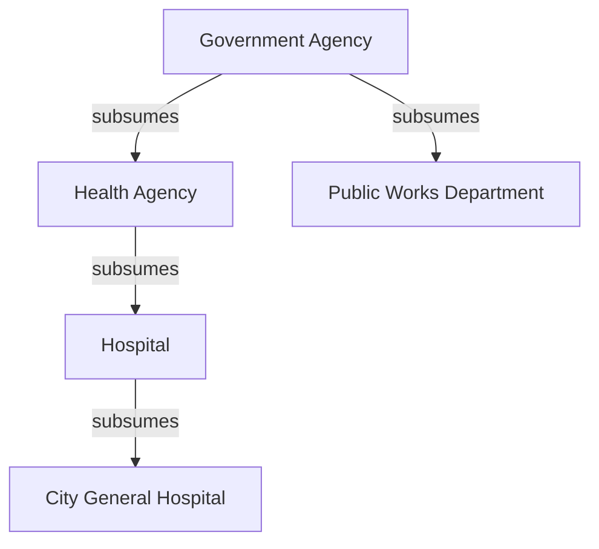
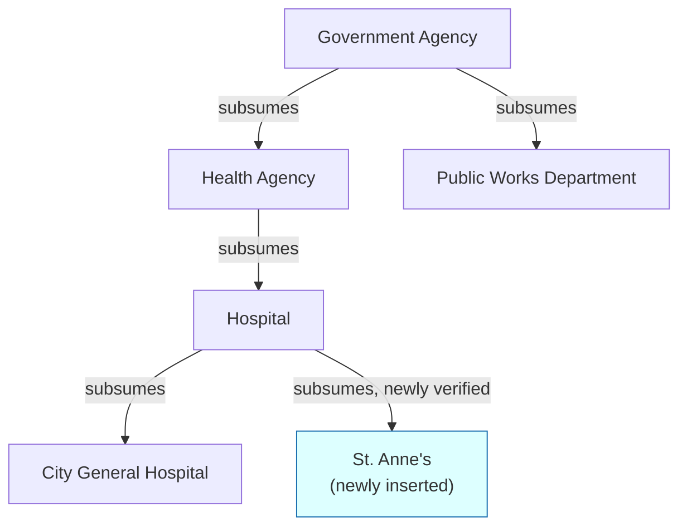

## Tracing a Small Worked Example of a New Node Being Inserted into an Existing Toy Knowledge Graph, Start to Finish, Using Every Tool Introduced So Far

### Setting Up the Toy Graph

Consider a small, five-node knowledge graph, already built up through some number of earlier insertions, representing a slice of a city's public-institution landscape:

Each edge here is a previously verified subsumption relationship, of exactly the kind traced when working through the Healthcare Facilities and Hospitals example — the difference being that this toy graph's edges are stipulated as already correct, so this trace can focus entirely on what happens when a genuinely new mention arrives. "City General Hospital" is the graph's only specific hospital instance so far; "Public Works Department" sits as an unrelated sibling category under the same top-level "Government Agency" node.

### The New Mention Arrives

A new document is processed, containing the sentence: "St. Anne's, a public hospital serving the northern district, opened a new maternity wing this month." The extraction step — assumed here as already-solved upstream work, since this chapter's concern is what happens once a mention has been identified, not how it was extracted — yields a candidate entity mention: **"St. Anne's"**, with surrounding context identifying it as a public hospital.

This is the single event that triggers the entire trace below: the pipeline must now decide, working through every tool this curriculum has built, whether "St. Anne's" refers to something already in the graph or needs a new node, and if a new node, exactly where it belongs.

### Stage One: Geometric Candidate Generation

Recall that an embedding function maps this mention, together with its surrounding context, to a vector positioned so that proximity in that space is engineered to reflect semantic similarity. Recall separately that comparing this new vector against every one of the graph's five existing node embeddings via brute-force linear scan is the honest baseline — trivial at this toy scale, but recall from the discussion of exact nearest-neighbor search that this approach's cost grows linearly with the number of existing nodes, and that a real graph accumulated over a long incremental construction process would instead rely on an approximate structure such as HNSW to retrieve a candidate shortlist in sub-linear time. At five nodes, brute force and an ANN index would return the identical shortlist; the point of naming both here is that the *architectural choice* between them is exactly the cost-of-growth distinction this curriculum built up separately, and it applies to this insertion regardless of which the graph happens to use at its current size.

Running the (illustrative) similarity comparison against all five existing nodes:

| Existing node | Cosine similarity to "St. Anne's" mention |
| --- | --- |
| City General Hospital | 0.86 |
| Hospital | 0.74 |
| Health Agency | 0.61 |
| Government Agency | 0.39 |
| Public Works Department | 0.11 |

[Speculation] These specific figures are illustrative rather than computed from a real embedding model, but the pattern is realistic and worth reading carefully: the highest score belongs to "City General Hospital," a different specific named hospital, not because the two are the same entity but because both mentions share dense hospital-related vocabulary — precisely the kind of coincidental topical proximity flagged repeatedly across this curriculum as something a similarity score cannot, on its own, distinguish from genuine identity.

Applying a generous, recall-oriented cutoff — the same design choice discussed when combining a prefilter with an LLM judgment, deliberately wide rather than tight — the **generator** stage of the generator-verifier-pruner pattern proposes a shortlist: {City General Hospital, Hospital, Health Agency}, discarding "Public Works Department" and, more marginally, "Government Agency" as implausible.

### Stage Two: Entity Resolution — Is This a Duplicate?

The first relational question the **verifier** stage must answer is entity resolution's defining question: does "St. Anne's" refer to an entity already present in the graph? The only candidate close enough to be a plausible identity match is "City General Hospital," the top-ranked shortlist item.

Posed directly as an LLM-as-a-judge question — recall that this is a generative, language-based relational judgment, not a distance measurement — "Does 'St. Anne's' refer to the same real-world entity as 'City General Hospital'?" A competent judgment correctly answers **no**: nothing in the context indicates these are alternate names for one institution; they are two distinct, separately named public hospitals. This is exactly the discriminating power a similarity score alone could not supply — recall that the raw similarity ranking placed "City General Hospital" *above* the correct treatment of this mention as a new entity, and only the semantic judgment stage was equipped to catch that the numeric proximity was coincidental rather than identity-indicating.

**Verdict of Stage Two: "St. Anne's" is a genuinely new entity. A new node must be created.**

### Stage Three: Categorical Placement — Where Does the New Node Belong?

With entity resolution settled, the remaining shortlist candidates — "Hospital" and "Health Agency" — are now evaluated not as identity candidates but as **candidate parent categories** for a new node, exactly the placement problem separated out from entity resolution when that distinction was first drawn. This is a subsumption judgment: recall that subsumption asks whether every instance of a more specific concept is necessarily an instance of a more general one.

Posed directly: "Is every instance of 'St. Anne's' necessarily a 'Hospital'?" Given the context explicitly identifies it as "a public hospital," the answer is a clean **yes** — this is exactly the kind of uncontroversial, low-ambiguity subsumption link that gave no trouble in the earlier worked chain. The second candidate, "Health Agency," is a coarser-grained category two levels up; recall that a well-designed placement process should attach a new node at the most specific correctly-verified level rather than defaulting to a broader ancestor, so "Hospital" — a direct sibling relationship to the existing "City General Hospital" node — is the correct attachment point, not "Health Agency" directly.

**Verdict of Stage Three: attach the new "St. Anne's" node directly beneath "Hospital."**

### Stage Four: Trusting the Ancestor Chain

Having verified only the single new edge — "St. Anne's" subsumed by "Hospital" — the pipeline now faces the exact choice named when discussing why patching non-transitivity by assuming it holds is a real engineering choice with a real cost: does it also independently re-verify "is every instance of St. Anne's necessarily a Health Agency" and "is every instance of St. Anne's necessarily a Government Agency," or does it trust those two further-up relationships automatically, via transitivity, because "Hospital" is already verified as subsumed by "Health Agency," which is already verified as subsumed by "Government Agency"?

For this toy graph, at this shallow depth, the assumption is low-risk: the "Hospital → Health Agency → Government Agency" chain does not carry the kind of ambiguous, context-shifting term — recall "commercial" in the Healthcare Facilities case — that produced a false composed conclusion in the earlier worked failure. This trace makes the deliberate choice explicitly, rather than by default: given the shallow depth and the absence of any known ambiguous term along this specific chain, the pipeline accepts the transitive closure without additional verification calls, accruing the efficiency benefit while explicitly acknowledging, per that earlier item's framing, that this is a bet rather than a proof.

### Committing the Insertion

The graph is updated to reflect all three verified decisions — new node, correct parent edge, and the accepted (not separately re-verified) ancestor chain above it:

Note precisely what changed and what did not: exactly one new node and one new edge were added, and the new node is correctly positioned as a sibling to "City General Hospital" rather than merged into it — the outcome that entity resolution's LLM-judgment stage specifically made possible by correctly rejecting the coincidental similarity signal from Stage One.

### The Pruner's Role, Here and Later

No pruner action was triggered during this specific insertion, and that is itself worth noting explicitly: recall that the pruner operates retrospectively, on its own schedule, examining already-committed graph structure rather than reacting to a single incoming mention. Nothing about this trace ran a pruner pass, because nothing about a single well-executed insertion requires one. The pruner's relevance to this exact insertion would surface later — if, at some future point, a further mention arrives that a missed entity-resolution match causes to be logged as yet another distinct hospital node that should actually have matched "St. Anne's," a later pruner sweep, examining the graph's accumulated structure rather than any single new mention, is the mechanism positioned to eventually catch that duplication, exactly as traced through the Municipal Health Department duplicate example when that pattern was introduced.

### Accounting the Cost of This One Insertion

Tallying what was actually spent: one geometric similarity computation against five existing node embeddings (or, at a larger and more realistic scale, one sub-linear ANN query), one LLM-as-a-judge call for entity resolution (checking the single most plausible identity candidate, not all five nodes), and one LLM-as-a-judge call for categorical placement (checking the single most specific plausible parent, not both shortlisted candidates in full, since "Hospital" being confirmed made checking "Health Agency" directly unnecessary). Zero further LLM calls were spent re-verifying the ancestor chain above "Hospital," because that cost was deliberately not paid, per the explicit choice made in Stage Four.

This is the concrete, itemized instance of the two-toolkit mixture argued for when comparing the geometric and semantic toolkits: the expensive semantic-judgment calls were spent exactly twice, on exactly the two decisions a fixed geometric formula was shown to be structurally incapable of making correctly, while every broader, larger-scale comparison was handled by the cheap geometric stage. Recall, finally, that this per-insertion cost accounting is itself an empirically measured cost curve, not a theoretical bound — a single traced insertion, however illustrative, is one data point, and recall from distinguishing a theoretical bound from a measured curve that generalizing from one small worked trace to a claim about how this pipeline's cost scales across thousands of future insertions would require the same caution about sample size and input distribution flagged when that distinction was first introduced.

### What This Trace Demonstrates as a Whole

Every tool this chapter and its predecessors introduced appeared in this single insertion for a specific, non-interchangeable reason: embeddings and cosine similarity generated a cheap candidate shortlist; the awareness of exact-versus-approximate search framed why that shortlist generation would scale at a larger graph size; an LLM-as-a-judge call resolved the entity-identity question a similarity score alone got misleadingly close to answering wrong; a separate LLM-as-a-judge call resolved the categorical placement question; an explicit, acknowledged assumption about transitivity governed how much of the ancestor chain was re-verified versus trusted; and the generator-verifier-pruner framing explained both why no pruner action was needed here and what role it would play if a later insertion introduced exactly the kind of duplicate this trace's Stage Two was specifically designed to avoid. No single tool, used alone, would have produced the correct final graph state — the correct outcome required each tool doing precisely the job it was shown, across this curriculum, to be suited for, and none of the jobs it was shown to be unsuited for.

**Related Topics**

- Direct explanations of Funk et al.'s transitivity failure and the four other named mechanisms in the capstone synthesis chapter
- Scaling this same trace's cost accounting to a graph several orders of magnitude larger than this toy example
- Designing a concrete trigger schedule for when a pruner pass should run relative to an ongoing stream of insertions
- Sensitivity of the Stage Four transitivity-trust decision to chains containing ambiguous, context-shifting terms
- Empirically benchmarking this exact pipeline's insertion cost curve against its theoretical cost model at realistic scale
- Extending this trace to a mention that triggers a genuine merge rather than a new-node creation