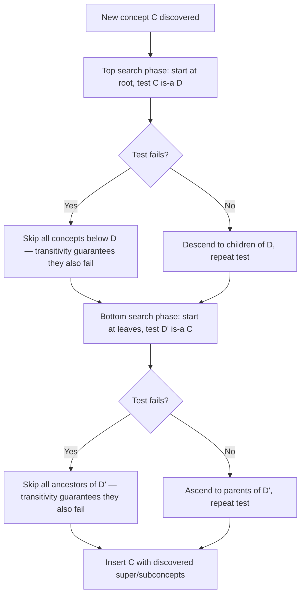

## Funk et al.'s documented failure of LLM subsumption transitivity, and how their tree-search insertion approach works around it rather than solving it

### The B-tree rebalancing analogy

When a B-tree splits an overfull leaf, the resulting index update is not a random patch — it exploits a structural invariant of the tree (keys are ordered, every subtree lies strictly between its bounding keys) to decide, in $O(\log n)$ comparisons, exactly where the new key belongs without touching most of the tree. The moment that ordering invariant is violated somewhere in the tree, every optimization built on top of it becomes unsound: a binary search over an unsorted array does not merely get slower, it starts returning wrong answers with full confidence.

Funk et al.'s ontology-construction system runs into exactly this situation, but the "ordering invariant" it depends on is the transitivity of the subsumption relation — recall from Chapter 08 that a subsumption judgment answers "is X a kind of Y?" and is a distinct operation from a numeric similarity score. Their insertion algorithm is a tree-search procedure that is only correct if subsumption is transitive, and their own experiments show that queries to an LLM do not reliably produce a transitive relation. What they build afterward is not a fix for that violated invariant — it is a decision to keep using the tree-search algorithm anyway and accept the resulting risk.

### Setting: the concept-hierarchy construction pipeline

Funk et al. (2023), a research group centered at Leipzig University, present a method for automatically constructing a concept hierarchy for a given domain by repeatedly querying GPT-3.5. Starting from a seed concept $C_0$ such as *Animals*, their algorithm repeatedly asks the LLM whether a concept has subconcepts, lists them, describes them, verifies them, and inserts the surviving candidates into a growing structure. The resulting hierarchy is explicitly not required to be a tree, since a concept can have more than one superconcept, so the final structure is a directed acyclic graph (DAG).

They formalize the target structure precisely: a concept hierarchy is a preordered set — a set equipped with a relation that is reflexive and transitive but not required to be antisymmetric, so two distinct concepts can each subsume the other, in which case they are treated as synonyms. That single word — *transitive* — is the property their insertion algorithm depends on and the property their own LLM queries fail to guarantee.

### The documented failure

The failure is not a hypothetical concern raised in their discussion section; it is an empirical result reported directly from their GPT-3.5 queries. Querying GPT-3.5 for subcategories does not produce a transitive subsumption relation. Their concrete example, stated in their own hierarchy-building notation:

$$\text{CommercialBuilding} \sqsupseteq \text{HealthcareFacilities} \sqsupseteq \text{Hospitals}, \quad \text{but} \quad \text{CommercialBuilding} \not\sqsupseteq \text{Hospitals}$$

Each of the two individual links was affirmed by the LLM when asked directly, and the direct link implied by chaining them was rejected when asked directly. They offer two explanations: possibly the middle subsumption is simply wrong, or — more interestingly — GPT-3.5's US-centric training data makes classifying healthcare facilities as commercial buildings reasonable from a US administrative-law perspective, while hospitals are still judged not to be commercial buildings in the everyday sense, because natural language is vague and underspecified rather than logically precise. A second, structurally identical example they report: Hot Beverages subsumes Coffee, Coffee subsumes Iced Coffee, but the direct link between Hot Beverages and Iced Coffee is not reliably affirmed — the failure is not a one-off artifact of one prompt, it recurs across unrelated domains.

The deeper point, which they state directly, is that this is not obviously a bug in the sense of a mistake to be corrected: accepting the non-transitivity of the subsumption relation as ground truth would undermine the entire idea of a concept hierarchy, since it is unclear in what sense a non-transitive relation could still be called a hierarchy at all. They are caught between two unattractive positions: trust the LLM's individual judgments completely and lose the hierarchical structure they are trying to build, or impose structure and accept that some imposed edges were never actually verified.

### Why this failure is exactly the transitivity risk named in Chapter 08

Recall from Chapter 08 that transitivity of subsumption judgments is *desired* by anyone building a hierarchy but is *not guaranteed* by an LLM acting as a semantic judge, because each judgment is drawn independently from a model with no obligation to keep its answers logically consistent across separate calls. The Healthcare Facilities / Hospitals example is precisely this failure mode instantiated: three individually plausible judgments ($A \sqsupseteq B$, $B \sqsupseteq C$, and the rejection of $A \sqsupseteq C$) that cannot all be true simultaneously in classical set-theoretic semantics, yet all three came from the same model with no internal contradiction flagged.



```
<svg xmlns="http://www.w3.org/2000/svg" viewBox="0 0 640 380">
  <text x="320" y="26" font-size="15" font-weight="bold" text-anchor="middle" fill="#222">The Non-Transitive Triple (svg_diagram)</text>

  <circle cx="320" cy="80" r="50" fill="#e6f0ff" stroke="#2b6cb0" stroke-width="2" />
  <text x="320" y="85" font-size="13" text-anchor="middle" fill="#1a365d">Commercial Building</text>

  <circle cx="320" cy="200" r="55" fill="#e6f0ff" stroke="#2b6cb0" stroke-width="2" />
  <text x="320" y="196" font-size="13" text-anchor="middle" fill="#1a365d">Healthcare</text>
  <text x="320" y="212" font-size="13" text-anchor="middle" fill="#1a365d">Facilities</text>

  <circle cx="320" cy="320" r="45" fill="#e6f0ff" stroke="#2b6cb0" stroke-width="2" />
  <text x="320" y="325" font-size="13" text-anchor="middle" fill="#1a365d">Hospitals</text>

  <line x1="320" y1="130" x2="320" y2="145" stroke="#2f855a" stroke-width="3" />
  <text x="345" y="140" font-size="12" fill="#2f855a">LLM: yes</text>

  <line x1="320" y1="255" x2="320" y2="275" stroke="#2f855a" stroke-width="3" />
  <text x="345" y="270" font-size="12" fill="#2f855a">LLM: yes</text>

  <path d="M 260 80 C 100 200 100 320 270 320" fill="none" stroke="#c53030" stroke-width="3" stroke-dasharray="8,5" />
  <text x="60" y="205" font-size="12" fill="#c53030">LLM: no (direct query)</text>

  <text x="320" y="360" font-size="12" text-anchor="middle" fill="#555">Two "yes" edges chain to imply this "no" edge — the LLM's own judgments are inconsistent.</text>
</svg>
```

### The tree-search insertion algorithm: KRIS

Facing this, Funk et al. still needed an *efficient* way to place each newly discovered concept into the existing hierarchy — not just attach it under the one superconcept it was discovered from, but find *all* of its superconcepts and subconcepts among the hundreds of concepts already in the structure. The naive brute-force approach — testing every existing concept D by asking both "is C a subconcept of D?" and "is D a subconcept of C?" — was ruled out as impractical, since it requires a huge number of slow, costly API queries for every single insertion. This is exactly the linear-scan cost problem named in Chapter 03: with $n$ existing concepts, brute-force placement costs $O(n)$ LLM calls per insertion, and the calls themselves are not cheap.

Their solution borrows a decades-old algorithm from description-logic reasoning. They adopt the KRIS algorithm, originally proposed by Baader, Hollunder, Nebel, Profitlich, and Franconi as the "enhanced traversal method" for classifying concepts against a terminological reasoner, adapting it so that concept discovery and insertion can be interleaved rather than requiring the full concept set to be known in advance. The core mechanism is a two-phase tree search:

- **Top search phase.** Starting from the most general concepts (nearest the root, or seed concept $C_0$) and proceeding downward, test whether the new concept $C$ is subsumed by each candidate superconcept $D$. The moment a subsumption test $C \sqsubseteq D$ fails, every concept more specific than $D$ can be skipped without testing it, because transitivity guarantees that if $C$ is not a subconcept of $D$, it cannot be a subconcept of anything below $D$ either.
- **Bottom search phase.** A mirror-image search starting from the most specific existing concepts and moving upward, pruned by the same logic in reverse, to find all of $C$'s subconcepts.

This is structurally the same pruning principle used by a skip list or a B-tree index: the search discards entire subtrees without visiting them, and the number of subsumption tests actually performed scales far below the $O(n)$ brute-force bound — but the pruning is only *sound* because it leans on transitivity to justify skipping the untested branch. Recall from Chapter 04 that HNSW's layered greedy routing gets its speed from an analogous trust: it assumes the graph's existing edges reliably point toward closer neighbors, and if that assumption is violated locally, the search silently skips the correct answer rather than raising an error.



### The pragmatic workaround: imposing transitivity rather than verifying it

Having built an algorithm that requires transitivity, and having documented empirically that their LLM's judgments are not reliably transitive, Funk et al. do not attempt to detect or repair inconsistent triples before insertion. Instead, they deal with the issue pragmatically by simply imposing that the subsumption relation is transitive: when a concept D is discovered as a subconcept of C, they take it for granted that C is a subconcept of every concept E that D is already known to be a subconcept of, without separately asking the LLM to verify each of those implied links. In other words, once two edges exist in the DAG, the third (transitively implied) edge is written into the hierarchy by assumption, never by an independent LLM query.

This is a deliberate trade: it keeps the KRIS-based tree search sound *by construction* — the algorithm never needs to reconsider whether its pruning was justified, because transitivity is now true by fiat rather than by verified fact — but it means every transitively-inferred edge in their published hierarchies is potentially exactly the kind of edge their own Commercial Building / Hospitals example shows can be false.

They report two concrete consequences of this choice. If the LLM's underlying answers are not actually transitive, the imposed-transitivity assumption can cause some genuine sub- or superconcept relations to be missed entirely, and in principle it could produce cycles in the subsumption relation between concepts that are not truly synonyms — though they report that in their experiments these effects appeared only rarely, and outright cycles did not appear at all. "Rarely observed in this sample of runs" is an empirical, not a theoretical, guarantee, and should be read as [Unverified] beyond the specific domains and depths they tested — Activities, Animals, Buildings, Diseases, Drinks, Fuels, Goats, Music, and Plants, at exploration depths bounded to keep the hierarchies tractable.

### Why this is a workaround, not a solution

Recall from the general principle established in this chapter that evaluating placement correctness is a separate problem from evaluating insertion cost: a fast insertion is not thereby a correct one. The KRIS-based tree search is exactly the "fast" half of that pair. It reduces the number of LLM queries required to place a new concept from a linear scan down to something close to logarithmic in well-balanced regions of the hierarchy, and it does so by leaning on an invariant — transitivity — that the same paper's own experiments show the underlying LLM does not reliably provide.

The workaround does not restore the invariant; it substitutes an assumption for a verification step and then reports, after the fact, that the assumption did not visibly break anything in their particular test domains. That is a measurement of consequences, not a proof of soundness: nothing in the algorithm detects the case where an imposed, unverified edge is wrong, and nothing prevents that wrong edge from silently guiding the top-down or bottom-up pruning decision for every concept inserted afterward — precisely the "errors propagate through routing" failure mode general to graph-structured insertion. The paper is explicit that it never claims to have solved the transitivity problem; it treats the transitivity assumption as a *known, accepted source of risk* traded for tractable insertion cost, and hands the open question — how to verify or repair non-transitive LLM judgments without paying the brute-force $O(n)$ cost — to future work.

**Key Points**

- Funk et al.'s insertion algorithm requires the subsumption relation to be transitive in order for its top-down/bottom-up pruning to be sound, exactly as a B-tree search requires key ordering to be sound.
- Their own experiments document that GPT-3.5's subsumption judgments are not reliably transitive, using the Commercial Building / Healthcare Facilities / Hospitals triple and the Hot Beverages / Coffee / Iced Coffee triple as concrete counterexamples.
- Brute-force verification of every candidate super/subconcept pair was ruled out as too costly in LLM queries, motivating adoption of the KRIS algorithm's pruned tree search.
- Their fix for the transitivity gap is not detection or repair — it is to impose transitivity by assumption on newly inferred edges, skipping LLM verification of those specific edges entirely.
- This trades verified correctness for insertion speed and is explicitly reported as a pragmatic choice with acknowledged risks (missed relations, theoretical possibility of spurious cycles), not a resolution of the underlying inconsistency.

**Related Topics**

- The KRIS/enhanced-traversal algorithm's original formulation in classical description-logic ontology classification (Baader et al.) versus its adaptation to interleaved discovery-and-insertion
- How exploration-depth cutoffs and frequency-threshold sampling in Funk et al.'s listing step interact with the transitivity-imposition risk at greater hierarchy depth
- Comparing this workaround to the generator-verifier-pruner architectural pattern from earlier in this chapter, which adds an explicit verification stage rather than assuming correctness
- iText2KG's similarity-threshold approach as a contrasting strategy for controlling insertion errors without relying on logical transitivity at all
- Formal repair strategies for non-transitive relations (e.g., taking the transitive reduction of only the verified edges) as an alternative this paper does not pursue