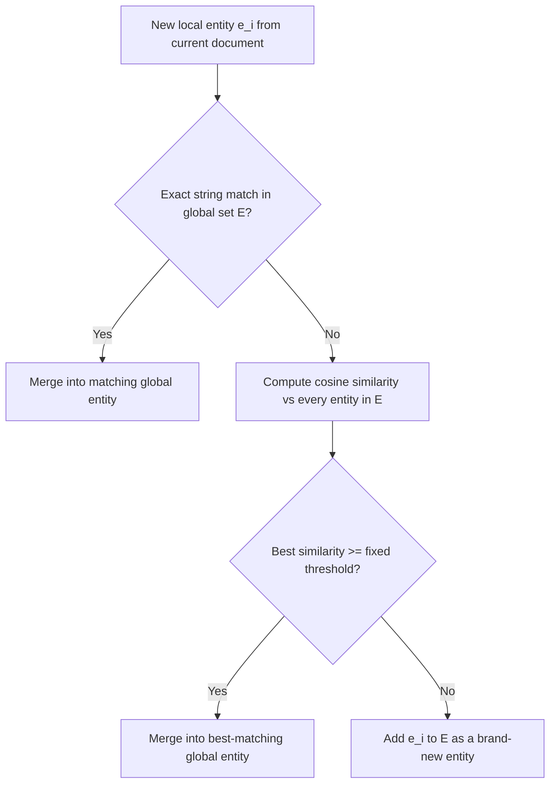

## iText2KG's fixed cosine similarity threshold of 0.6, and why the paper itself names eliminating this fixed threshold as unresolved future work

### The fixed-timeout analogy

A TCP implementation that used a single hard-coded retransmission timeout for every connection, regardless of network conditions, would work fine on a local, low-latency network and fail constantly on a high-latency satellite link — the fixed constant cannot be correct for every regime it gets applied to, which is exactly why modern TCP stacks estimate the timeout adaptively from measured round-trip times instead of hard-coding one number. A single global cosine similarity threshold used to decide "are these two entities the same thing" has the identical structural weakness: it is one constant applied uniformly across every entity type, every domain, and every region of the embedding space, even though the underlying similarity signal behaves differently in each of those regions.

iText2KG is a knowledge-graph-construction system built exactly on this kind of fixed threshold, and — notably for this capstone — the authors say so themselves, naming the removal of that fixed constant as an open problem in their own paper's final paragraph rather than treating it as a solved design decision.

### Recap: what a similarity threshold actually decides

Recall that an embedding model maps text into a vector space engineered so that vectors close together tend to represent semantically similar content, and that cosine similarity measures the cosine of the angle between two vectors, ignoring their magnitude, as a numeric proxy for that closeness. Recall also that choosing a similarity threshold to decide "these two vectors represent the same underlying thing" is an empirical engineering choice, not a mathematically derived constant — the threshold has to be tuned against real data, and it carries genuine failure modes on both sides: set it too low and unrelated entities get merged together; set it too high and true duplicates are left unmerged, fragmenting the graph.

### iText2KG's architecture and where the threshold sits

iText2KG, introduced by Lairgi et al., constructs knowledge graphs incrementally from raw documents using an LLM, and is explicitly designed to avoid the post-processing and duplicate-entity problems that plague naive LLM-based graph construction. Its second module, the Incremental Entities Extractor (internally called the iEntities Matcher), maintains a single running set of "global" entities discovered so far, $E$. For every new document, the system extracts a set of "local" entities and must decide, for each one, whether it is a brand-new entity or a duplicate of something already in $E$.

The matching procedure is a simple two-tier decision: first check for an exact string match against $E$; if that fails, compute the cosine similarity between the new entity's embedding and every existing entity's embedding in $E$, and if the best match exceeds a predefined threshold, merge the new entity into that existing node rather than creating a new one. Both entities and relations pass through the same style of check, using a separate threshold for each. Notably, unlike the two-stage embedding-plus-LLM pipelines recalled from Chapter 09 — where an initial embedding filter is followed by an LLM asked to confirm or reject the match — iText2KG's matching decision here is made by the threshold comparison alone, with no LLM verification step in the loop.



### Where the number 0.6 comes from

The threshold was not picked arbitrarily; the authors built a small labeled dataset — 1,500 pairs of genuinely similar entities and 500 pairs of genuinely similar relationships, generated with GPT-4 across domains such as news, scientific articles, and HR — and embedded every pair with OpenAI's `text-embedding-3-large` model. They then measured the mean and standard deviation of cosine similarity across those labeled pairs. The measured statistics: for the entities dataset, mean cosine similarity was $0.6$ with standard deviation $0.12$; for the relationships dataset, mean cosine similarity was $0.56$ with standard deviation $0.10$.

This is the empirical origin of the "0.6" figure this item names: it is the observed average cosine similarity between pairs of entities that a human-in-the-loop dataset had already labeled as true duplicates, under one specific embedding model. The paper describes choosing an upper threshold such as 0.7 to favor precision, noting that a lower threshold instead favors resolution specificity — i.e., there is an explicit precision/recall knob buried in this single scalar, and the published usage examples for the released implementation set the entity threshold at exactly 0.6, matching the measured mean rather than the higher precision-favoring value discussed in the text. [Unverified] Later releases of the accompanying open-source library moved the default entity threshold to 0.8 and relation threshold to 0.7, and added separate weighting for an entity's name versus its type label — this reflects the software evolving after publication and should not be read as evidence that the paper's own stated open problem was resolved by the paper itself.

### Why a single global scalar is fragile

The core issue is a mismatch between what a threshold assumes and how embedding spaces actually behave. A fixed threshold implicitly assumes that "distance corresponding to true duplication" is a constant that holds uniformly across the whole vector space. But recall from Chapter 02 that embedding proximity is an engineered proxy for semantic similarity, not a physical law, and that its reliability is domain- and model-dependent — regions of the space corresponding to different entity types (people, organizations, abstract concepts, dates) can have systematically different local densities and different "typical" similarity gaps between true duplicates and near-misses.

A concrete failure this exact fragility produces: an entity named "Python" used in a computer-science document and an entity named "Python" used in a biology document sit close together in embedding space because their surface names are identical, even though one denotes a programming language and the other an animal genus. A single cosine-similarity cutoff applied to the raw name embedding cannot separate these — the similarity between "Python" and "Python" is 1.0 regardless of what each instance means, and a threshold of 0.6 will happily merge them into one incorrect entity. This is precisely the kind of collision that motivated the later library revision to weight in the entity's type label alongside its name — a fix aimed at the exact gap the original paper's authors flagged as future work, using a different lever (adding a feature) rather than removing the threshold itself.



```
<svg xmlns="http://www.w3.org/2000/svg" viewBox="0 0 640 380">
  <text x="320" y="26" font-size="15" font-weight="bold" text-anchor="middle" fill="#222">One Threshold, Two Overlapping Distributions (svg_diagram)</text>

  <line x1="60" y1="320" x2="600" y2="320" stroke="#333" stroke-width="2" />
  <text x="330" y="350" font-size="13" text-anchor="middle" fill="#333">Cosine similarity of a candidate pair</text>

  
  <path d="M 100 320 C 180 200 220 100 300 100 C 380 100 420 200 500 320" fill="none" stroke="#2f855a" stroke-width="3" />
  <text x="180" y="90" font-size="12" fill="#2f855a">True duplicate pairs (e.g. person-name entities)</text>

  
  <path d="M 260 320 C 330 240 370 180 430 180 C 490 180 530 240 580 320" fill="none" stroke="#c53030" stroke-width="3" />
  <text x="430" y="165" font-size="12" fill="#c53030">Distinct entities sharing a surface name</text>

  
  <line x1="370" y1="60" x2="370" y2="320" stroke="#2b6cb0" stroke-width="2" stroke-dasharray="6,4" />
  <text x="378" y="70" font-size="12" fill="#2b6cb0">Fixed threshold = 0.6</text>

  <text x="320" y="365" font-size="12" text-anchor="middle" fill="#555">The shaded overlap region is where a single scalar cutoff misclassifies pairs from BOTH distributions.</text>
</svg>
```

### Why this connects to the thesis's own comparison of insertion strategies

Recall from Chapter 07 that embedding-threshold insertion is one of the specific strategies this thesis compares directly against brute-force, ANN-index, and bounded-bucket insertion, and that its defining property is deciding placement purely from a similarity cutoff, with no additional structural or verification step. iText2KG's iEntities Matcher is a real, published instance of exactly that strategy, applied to graph construction rather than a synthetic benchmark, and the paper's own experiments and its own stated future work together constitute direct evidence for the general claim that a bare similarity-threshold strategy has a precision/recall tradeoff baked into a single hyperparameter that cannot be tuned away — only shifted from one kind of error to the other.

### Why the authors name this as unresolved, not solved

The paper's conclusion is explicit about what it considers still open. Future work is described as focused on improving similarity-based matching metrics, removing the need to specify a threshold as a hyperparameter at all, and incorporating entity type into the matching decision. This is a direct, first-party acknowledgment — not an outside critique — that the fixed threshold is a known limitation of the published method rather than a deliberately settled design choice. Two things about that acknowledgment matter for how this mechanism should be read in a synthesis chapter:

- The authors do not claim 0.6 (or 0.7) is the "correct" value in any principled sense — it is an empirically fitted constant from one 1,500-pair, GPT-4-generated, single-embedding-model dataset, and there is no guarantee it generalizes to entity types, languages, or domains outside that sample.
- "Eliminating the threshold as a hyperparameter" is stated as the actual goal, not merely tuning it better — the authors' own framing is that a scalar cutoff is the wrong kind of object to be deciding entity identity, echoing the general critique that a fixed threshold cannot simultaneously be correct across regions of embedding space with different local similarity statistics.

**Key Points**

- iText2KG's entity-resolution module (iEntities Matcher) decides duplicate entities purely by comparing cosine similarity against a single fixed threshold, with no LLM verification step in that decision.
- The value 0.6 traces to an empirically measured mean cosine similarity (σ = 0.12) across a labeled dataset of 1,500 true-duplicate entity pairs, embedded with `text-embedding-3-large`; the paper separately discusses an upper threshold such as 0.7 as favoring precision, so "the threshold" and "the measured mean" are related but not identical figures.
- A single global scalar threshold is structurally fragile because embedding similarity statistics differ across entity types and domains, producing concrete failures such as merging same-named but semantically distinct entities.
- The paper's own conclusion names removing the threshold-as-hyperparameter design, improving the similarity metric, and adding entity type to the matching process as explicit future work — this is a first-party admission that the mechanism is a known limitation, not a resolved design choice.
- This mechanism is a real-world instance of the "embedding-threshold insertion" strategy named in Chapter 07's growth-cost framing, giving direct published evidence for that strategy's characteristic precision/recall tradeoff.

**Related Topics**

- Comparing iText2KG's single-stage threshold matching against SAC-KG's Generator-Verifier-Pruner architecture, which adds an explicit verification stage after candidate generation
- How per-type or per-region adaptive thresholds (rather than one global scalar) could be estimated from local density statistics in an embedding space
- The precision/recall tradeoff curve as a function of threshold value, and how to plot it from a labeled validation set like the one iText2KG's authors built
- DIAL-KG's ablation results as a further data point on how much a matching step's specific design choices affect downstream graph quality
- Later community-driven revisions to the iText2KG implementation (entity name/label weighting) as a partial, practical response to the exact gap the original paper names as unresolved