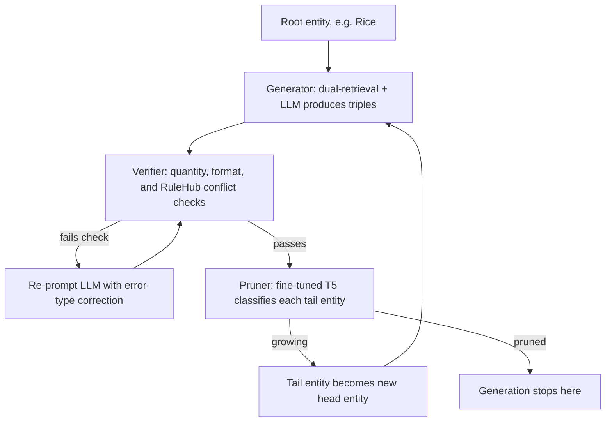

## SAC-KG's Generator, Verifier, and Pruner architecture as a concrete, published instance of the growth-decision pattern from Chapter 09

### The generational garbage collector analogy

A generational garbage collector does not treat every live object identically. When a minor collection runs, each surviving object faces a separate decision from "is this object still reachable" — it is asked whether it has survived enough collection cycles to be promoted into an older generation, where it will be scanned less frequently, or whether it should stay in the young generation, where it will be checked again soon. Reachability and promotion are two different questions, decided by two different pieces of logic, even though they both act on the same object at nearly the same moment.

SAC-KG's three-component architecture is built around exactly this separation, applied to knowledge-graph construction instead of memory management: one component decides what new content to propose, a second component decides whether that content is valid, and a third component — answering a genuinely different question — decides whether a piece of newly validated content should itself become a site of further growth. That third decision is the growth-decision pattern named in Chapter 09, and SAC-KG is a full, published, empirically evaluated system built around it.

### Recap: the generator-verifier-pruner pattern

Recall that the generator-verifier-pruner pattern separates a graph-construction pipeline into three concerns that are easy to conflate if built as one step: a *generator* proposes candidate new content (new nodes, new edges) from raw input; a *verifier* checks those candidates against constraints or rules and rejects or repairs the ones that fail; and a *pruner* takes the content that survived verification and decides, node by node, whether the graph should be allowed to keep growing outward from it. The pruner's decision is deliberately not a correctness check — a candidate can be perfectly valid and still be marked as not worth expanding further, because "is this true" and "is this a productive place to keep growing the graph" are different questions with different answers.

### SAC-KG: the published system

SAC-KG (Chen et al., 2024) is a domain-knowledge-graph construction framework built at Alibaba Cloud and the University of Science and Technology of China, published at ACL 2024. Its stated goal is to construct precise, domain-specific knowledge graphs directly from raw corpora without human intervention, and its headline result is a domain graph built at the scale of over one million nodes, achieving 89.32% precision — more than a 20-percentage-point improvement in precision over the prior state of the art on the same construction task. The framework explicitly frames its own construction process as an entity-induced tree search: starting from root entities, it grows the graph outward one layer at a time, deciding at each layer which nodes are worth expanding into the next.

This "tree search" label describes something different from the KRIS-based tree search used for concept-hierarchy insertion discussed earlier in this chapter — that search prunes branches of an *already-existing* structure while placing one new item; SAC-KG's tree search instead *builds* the structure outward, layer by layer, and its pruning decision is about whether to keep expanding, not about where a single new item belongs. Both are legitimately called tree search, but they answer different questions.

### Generator: proposing candidate structure

For a given entity — typically a domain-relevant noun such as a plant variety or a named individual — the Generator retrieves two kinds of grounding context before calling the LLM: a domain corpora retriever finds and ranks the most relevant sentences about that entity from raw domain text (segmenting the corpus into sentences and ranking by how often the entity is mentioned), and an open knowledge retriever pulls a handful of example triples about related entities from DBpedia, a large open-source encyclopedic knowledge graph. The DBpedia examples are used purely as in-context formatting guidance — the paper reports that when an entity has no direct match in DBpedia, its name is tokenized and re-queried piece by piece, and if that still fails, the system falls back to a small set of triples chosen arbitrarily from the open KG, which the authors report does not measurably hurt output quality. The LLM then generates a single-level set of (head, relation, tail) triples with the given entity fixed as the head, forming one layer of the growing subgraph.

### Verifier: rule-based validation, not judgment

The Verifier is deliberately rule-based and parameter-free rather than another LLM call, which keeps error checking cheap enough to run on every generated triple at scale. It runs three checks in sequence: a quantity check flags a layer as under-generated if it produced fewer than a small default number of triples; a format check catches triples that don't match the expected shape, that have the wrong head entity, or where the head and tail entities are identical; and a conflict check compares each triple against RuleHub, a public repository of more than seven thousand structural rules mined from existing open knowledge graphs, catching violations such as a birth date that falls after a death date. When a triple fails a check, the system re-prompts the LLM with an error-type-specific correction instruction rather than discarding it outright, though if too many triples in one batch are flagged, the system requests a full batch regeneration instead of patching triples individually.

### Pruner: the growth decision itself

The Pruner is the component that answers the growth question directly, and it is structurally distinct from the other two in an important way: it is not an LLM call and not a rule lookup, but a small fine-tuned classifier — a T5 model, fine-tuned with low-rank adaptation on labeled examples drawn from DBpedia, where head entities in that open graph became positive ("growing") examples and non-overlapping tail entities became negative ("pruned") examples. Given the tail entity of a verified triple, the Pruner outputs a binary label: growing, meaning this entity becomes a new head entity and gets fed back into the Generator for the next layer, or pruned, meaning generation stops at this leaf.

The paper is explicit that this is a separate axis of judgment from correctness: even a fully correct, verifier-approved triple can have its tail entity pruned, because the quality of a *tail entity as a future head* is what the Pruner is deciding, not whether the fact it appeared in was true. A worked example directly from the paper's rice-domain corpus makes the distinction concrete: the triple (rice, optimal growth temperature, 20-25 degrees Celsius) is correct, but its tail entity — a temperature range — has nothing further to generate about it, so the Pruner marks it pruned; an entity like a rice variety name or a named research institute, by contrast, is marked growing because there is a plausible next layer of facts about it.



### A worked, small example of the layered growth

Tracing the paper's own rice example: given the entity Rice and a supporting text passage describing its growth habits and cultivation requirements, the Generator produces triples such as (Rice, type, monocot), (Rice, growth habit, annual plant), and (Rice, cultivation requirements, ample water). The Verifier checks these for format and conflicts — none of these trip a RuleHub rule, so they pass unmodified. The Pruner then examines each tail entity individually: "monocot" and "ample water" are marked pruned, since neither is a fruitful root for further domain-specific expansion, while a tail entity naming a specific rice variety or research institute elsewhere in the same layer is marked growing and becomes the head entity for the next layer's Generator call. The graph therefore grows outward unevenly — some branches terminate after one layer, others continue for several — governed entirely by the Pruner's per-node decisions rather than by a uniform depth cutoff.



```
<svg xmlns="http://www.w3.org/2000/svg" viewBox="0 0 640 380">
  <text x="320" y="26" font-size="15" font-weight="bold" text-anchor="middle" fill="#222">Uneven Growth Driven by the Pruner (svg_diagram)</text>

  <circle cx="320" cy="60" r="34" fill="#e6f0ff" stroke="#2b6cb0" stroke-width="2" />
  <text x="320" y="65" font-size="13" text-anchor="middle" fill="#1a365d">Rice</text>

  <line x1="290" y1="90" x2="180" y2="160" stroke="#555" stroke-width="1.5" />
  <line x1="320" y1="94" x2="320" y2="160" stroke="#555" stroke-width="1.5" />
  <line x1="350" y1="90" x2="460" y2="160" stroke="#555" stroke-width="1.5" />

  <circle cx="180" cy="190" r="30" fill="#fde8e8" stroke="#c53030" stroke-width="2" />
  <text x="180" y="188" font-size="11" text-anchor="middle" fill="#742a2a">monocot</text>
  <text x="180" y="202" font-size="10" text-anchor="middle" fill="#742a2a">(pruned)</text>

  <circle cx="320" cy="190" r="30" fill="#fde8e8" stroke="#c53030" stroke-width="2" />
  <text x="320" y="188" font-size="10" text-anchor="middle" fill="#742a2a">ample</text>
  <text x="320" y="200" font-size="10" text-anchor="middle" fill="#742a2a">water (pruned)</text>

  <circle cx="460" cy="190" r="34" fill="#e6ffed" stroke="#2f855a" stroke-width="2" />
  <text x="460" y="185" font-size="10" text-anchor="middle" fill="#22543d">Gurdev Singh</text>
  <text x="460" y="198" font-size="10" text-anchor="middle" fill="#22543d">Khush (growing)</text>

  <line x1="440" y1="222" x2="400" y2="290" stroke="#555" stroke-width="1.5" />
  <line x1="480" y1="222" x2="520" y2="290" stroke="#555" stroke-width="1.5" />

  <circle cx="400" cy="315" r="28" fill="#fde8e8" stroke="#c53030" stroke-width="2" />
  <text x="400" y="313" font-size="10" text-anchor="middle" fill="#742a2a">geneticist</text>
  <text x="400" y="325" font-size="9" text-anchor="middle" fill="#742a2a">(pruned)</text>

  <circle cx="520" cy="315" r="32" fill="#e6ffed" stroke="#2f855a" stroke-width="2" />
  <text x="520" y="310" font-size="9" text-anchor="middle" fill="#22543d">Nat'l Academy</text>
  <text x="520" y="322" font-size="9" text-anchor="middle" fill="#22543d">of Sciences (growing)</text>
</svg>
```

### Why the ablation results validate the pattern's necessity

The paper's own ablation study isolates each component by removing it and measuring the resulting graph across three successive layers of growth. Removing the Pruner causes a marked drop in precision and domain specificity that grows worse at deeper layers — by the third iteration, the pruner-free variant's precision and domain-specificity scores fall well behind every other ablated variant, consistent with unfiltered low-quality tail entities compounding their damage as they keep serving as further generation roots. This is a direct, measured instance of the general principle, familiar from this chapter's discussion of graph drift under streaming updates, that an unfiltered growth decision does not merely add one bad node — it seeds every subsequent layer with more of the same, since the compounding pattern applies specifically to unchecked *growth* decisions, whereas the Verifier's rule-based checks were separately shown to keep raw error propagation across layers comparatively flat even without the Pruner in place. The Verifier's removal, by contrast, mainly reduces the number of triples the LLM is willing to produce with confidence, rather than driving the same kind of layer-over-layer compounding — reinforcing that the Verifier and Pruner really are answering different questions, with different failure signatures when removed.

**Key Points**

- SAC-KG separates knowledge-graph construction into a Generator (proposes triples via dual retrieval plus an LLM), a Verifier (rule-based correctness checks against a 7,000+-rule repository), and a Pruner (a fine-tuned classifier deciding whether a validated tail entity becomes a new growth root), making it a concrete, published instance of the generator-verifier-pruner pattern named in Chapter 09.
- The Pruner's decision is explicitly independent of triple correctness: a correct triple can still have its tail entity pruned, because the Pruner judges suitability for further expansion, not truth.
- SAC-KG's own paper frames construction as an entity-induced tree search that grows the graph outward layer by layer — a different meaning of "tree search" than the classification-style tree search used in concept-hierarchy insertion elsewhere in this chapter.
- The published ablation study shows that removing the Pruner produces the largest degradation at deeper layers, an empirical demonstration that an unchecked growth decision compounds error across layers in a way rule-based verification alone does not.
- The system achieves domain graphs at over a million nodes with 89.32% precision, evidence that the three-way separation of concerns scales to production-sized construction, not just small demonstrations.

**Related Topics**

- Comparing SAC-KG's classifier-based Pruner against a purely LLM-judged growth decision, and the cost/latency tradeoff between the two
- RuleHub-style rule mining as a lightweight, parameter-free alternative to LLM-based verification for structural consistency checks
- How the Pruner's DBpedia-trained head/tail distinction generalizes (or fails to generalize) to domains with very different entity type distributions than DBpedia's
- Connecting SAC-KG's dual-retrieval Generator design to the two-stage embedding-plus-LLM decision pipelines recalled from Chapter 09
- Extending the generator-verifier-pruner pattern to a live, streaming-update setting rather than SAC-KG's batch, layer-by-layer construction process