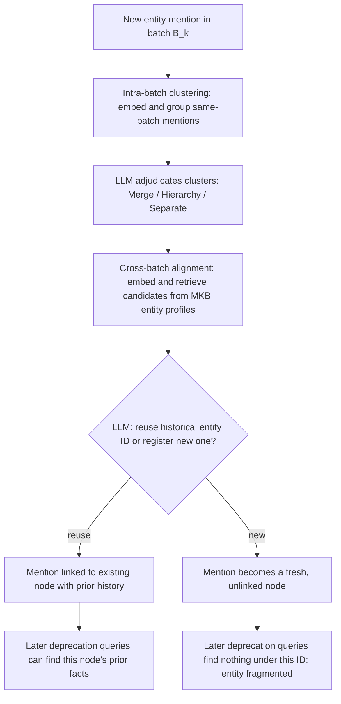

## DIAL-KG's own ablation result showing entity matching as the single point of failure, and what it means for one component's removal to collapse precision from 0.985 to 0.322 while other components barely matter

### The distributed primary-key analogy

In a sharded database, every downstream join, index lookup, and update statement quietly assumes that a given primary key always refers to the same underlying row, no matter which shard or which point in time the query came from. If the key-assignment logic starts occasionally minting a fresh key for a row that already exists elsewhere, nothing about the query engine itself breaks — SELECT and UPDATE statements still execute correctly, transactions still commit — but every query that depended on "this key means this row" now silently operates on the wrong data, or on no data at all, because the row it was looking for is sitting under a different key it never thinks to check.

DIAL-KG's ablation study is a clean, quantified demonstration of exactly this failure mode inside a knowledge-graph construction pipeline: the component responsible for deciding whether a newly mentioned entity is the same entity seen in an earlier batch, or a brand-new one, plays the role of that primary-key assignment logic. When it is disabled, every other stage of the pipeline keeps running and producing locally sensible output — but the one task that depends on stable entity identity across time collapses almost completely.

### Recap: entity resolution as a systems problem, and the two-stage pipeline

Recall that entity resolution — deciding whether two mentions refer to the same real-world thing — is a systems problem, not merely a matching heuristic, because a knowledge graph under continuous update has to make this decision correctly every time new information arrives, not just once at construction time. Recall also that a common pattern for making this decision is a two-stage embedding-plus-LLM pipeline: an embedding-based step narrows a large candidate pool down to a small shortlist cheaply, and a language model then makes the final judgment call on the shortlisted candidates, combining the speed of vector search with the discriminating judgment an LLM can apply to ambiguous cases.

### DIAL-KG's architecture and where entity matching sits

DIAL-KG (Bao et al.) is a schema-free, closed-loop framework for incremental knowledge graph construction, built around a persistent Meta-Knowledge Base (MKB) that stores entity profiles and candidate schemas across streaming batches of text. The system processes input in three stages per batch: Dual-Track Extraction (routing simple facts to triples and complex, time-sensitive statements to event structures), Governance Adjudication (evidence checks, logical consistency checks, and a judgment of whether new content is merely informational or signals that older knowledge has become outdated), and Schema Evolution (inducing new relation and event schema from validated content); a final Transactional Integration step atomically applies the batch's additions and deprecations to the graph. Rather than deleting outdated facts outright, the system marks them Deprecated while preserving their evidence and history — a soft-deprecation design built specifically for streaming update settings.

The entity-matching step this item is about — called Coreference Alignment in the paper — sits inside Dual-Track Extraction and operates in two levels. Intra-batch canonicalization computes embeddings for entity mentions found in the same batch, clusters them by similarity, has an LLM infer a type for each cluster, and adjudicates same-type pairs into one of three outcomes: merge them, treat one as more general than the other, or keep them separate. Cross-batch alignment then takes each of those canonicalized mentions and matches it against the entity profiles already stored in the MKB, retrieving the top candidates by embedding similarity and asking an LLM to decide whether to reuse an existing entity's historical ID or register a new one. This is precisely the two-stage embedding-plus-LLM pipeline recalled above, applied specifically to the question of whether a mention today is the same entity as one seen in an earlier batch.



### The two metrics the ablation is measured on

The paper reports two purpose-built metrics for its streaming setting rather than static precision alone. $\Delta\text{-Precision}$ measures the accuracy of newly added facts $A_t$ in a given window: $\Delta\text{-P}_t = |TP_t| / |A_t|$, where $TP_t$ counts additions an independent LLM judge marks as fully supported by the source text. Deprecation-Handling Precision, D-HP, measures the reliability of soft deprecations $\mathcal{D}_t$: $\text{D-HP}_t = |JD_t| / |\mathcal{D}_t|$, where $JD_t$ counts deprecations the judge confirms are backed by explicit textual evidence — in other words, D-HP asks not "did the system add good facts" but "when the system marked an old fact obsolete, was it actually targeting the right fact, for the right reason."

### The ablation table

Run on SoftRel-Δ, a purpose-built streaming dataset of 1,515 entries drawn from Kubernetes release logs across three time windows, the ablation isolates each of three components:

| Ablation Variant | Δ-Precision | D-HP |
| --- | --- | --- |
| Full Model | 0.976 | 0.985 |
| w/o Intent Assessment | 0.848 | N/A |
| w/o Event Representation | 0.850 | N/A |
| w/o Coreference Alignment | 0.860 | 0.322 |

Removing Evolutionary-Intent Assessment eliminates the system's ability to reliably decide that a statement signals an update to prior knowledge at all, so D-HP is reported as not applicable rather than as a number — the deprecation capability disappears rather than merely degrading. Removing event representation similarly harms decisions on complex, multi-argument facts closely enough to render D-HP inapplicable in the same way. Only the Coreference Alignment ablation leaves the deprecation mechanism nominally intact — the system still attempts soft deprecations and D-HP can be measured — and when measured, it collapses from 0.985 under the full model to approximately 0.322, the paper's own reported figure, attributed directly to entity fragmentation: the same real-world entity ends up scattered across multiple separate graph nodes, so a later deprecation attempt cannot reliably locate the correct prior fact to mark obsolete.



```
<svg xmlns="http://www.w3.org/2000/svg" viewBox="0 0 640 340">
  <text x="320" y="26" font-size="15" font-weight="bold" text-anchor="middle" fill="#222">Entity Fragmentation Breaking Deprecation Targeting (svg_diagram)</text>

  <text x="150" y="55" font-size="12" font-weight="bold" text-anchor="middle" fill="#333">With Coreference Alignment</text>
  <circle cx="150" cy="110" r="36" fill="#e6ffed" stroke="#2f855a" stroke-width="2" />
  <text x="150" y="106" font-size="10" text-anchor="middle" fill="#22543d">PodSecurityPolicy</text>
  <text x="150" y="118" font-size="9" text-anchor="middle" fill="#22543d">(status: active)</text>
  <line x1="150" y1="146" x2="150" y2="190" stroke="#2f855a" stroke-width="2" />
  <text x="185" y="172" font-size="10" fill="#2f855a">same node, updated</text>
  <circle cx="150" cy="220" r="36" fill="#e6ffed" stroke="#2f855a" stroke-width="2" />
  <text x="150" y="216" font-size="10" text-anchor="middle" fill="#22543d">PodSecurityPolicy</text>
  <text x="150" y="228" font-size="9" text-anchor="middle" fill="#22543d">(status: deprecated)</text>
  <text x="150" y="270" font-size="10" text-anchor="middle" fill="#22543d">Old fact correctly found and soft-deprecated</text>

  <text x="480" y="55" font-size="12" font-weight="bold" text-anchor="middle" fill="#333">Without Coreference Alignment</text>
  <circle cx="420" cy="110" r="36" fill="#fde8e8" stroke="#c53030" stroke-width="2" />
  <text x="420" y="106" font-size="10" text-anchor="middle" fill="#742a2a">PodSecurityPolicy</text>
  <text x="420" y="118" font-size="9" text-anchor="middle" fill="#742a2a">(status: active)</text>

  <circle cx="540" cy="220" r="36" fill="#fde8e8" stroke="#c53030" stroke-width="2" />
  <text x="540" y="216" font-size="10" text-anchor="middle" fill="#742a2a">PodSecurityPolicy'</text>
  <text x="540" y="228" font-size="9" text-anchor="middle" fill="#742a2a">(new, unlinked node)</text>
  <text x="540" y="270" font-size="10" text-anchor="middle" fill="#742a2a">Old fact never found: deprecation misfires</text>

  <line x1="440" y1="140" x2="520" y2="190" stroke="#c53030" stroke-width="2" stroke-dasharray="5,4" />
  <text x="500" y="165" font-size="10" fill="#c53030">fragmented identity</text>
</svg>
```

### Reading the collapse mechanistically

The paper's own worked case study makes the mechanism concrete. Given an input statement announcing that a Kubernetes API is deprecated in one version and slated for removal in a later one, the system extracts an event, an LLM correctly classifies the statement's intent as evolutionary rather than merely informational, and the pipeline then queries the MKB for existing relations involving the named entity, adding the new status fact and executing a soft deprecation on the prior, now-outdated status fact. Every one of those steps depends on the query in the last step correctly finding the *same* entity node that held the earlier fact. Coreference Alignment is the component responsible for guaranteeing that "the entity mentioned today" and "the entity that already has a status fact from an earlier batch" resolve to one node rather than two. Disable it, and the MKB query in that final step can land on a freshly minted, historyless node instead of the one actually carrying the fact that needs updating — the deprecation logic itself never changes, but it is now aimed at the wrong target, or at nothing at all.

### Why "other components barely matter" needs a careful reading

The item's framing that other components "barely matter" by comparison is true in one specific, narrow sense and should not be read more broadly than that. Both of the other ablated components — Evolutionary-Intent Assessment and event representation — are explicitly described in the paper as indispensable for reliable streaming governance, and their removal produces an even more severe qualitative outcome: D-HP becomes undefined (N/A) because the deprecation capability is not merely inaccurate but functionally absent. What makes the Coreference Alignment result distinctive is not that it is the only component that matters, but that it is the only one of the three whose removal leaves the deprecation mechanism *technically running* while quietly aiming it at the wrong data — producing the single largest quantified, directly comparable precision collapse in the table (0.985 to roughly 0.322), rather than a qualitative loss of capability. In the vocabulary used earlier in this chapter: a broken entity-matching step does not make the system slower or louder about its errors — it makes every downstream decision that depends on stable identity confidently wrong, which is exactly the "fast but wrong is not a solved problem" failure mode, now backed by a single, precisely measured number.

**Key Points**

- DIAL-KG's Coreference Alignment module is a concrete, two-stage embedding-plus-LLM entity resolution pipeline: intra-batch clustering and adjudication, followed by cross-batch matching against a persistent Meta-Knowledge Base of entity profiles.
- The paper's own ablation reports Deprecation-Handling Precision (D-HP) collapsing from 0.985 in the full model to roughly 0.322 when Coreference Alignment is disabled, attributed explicitly to entity fragmentation.
- The other two ablated components (Evolutionary-Intent Assessment, event representation) produce an even more categorical failure — D-HP becomes undefined rather than merely low — so "barely matter" should be read as "produce a less directly comparable quantified collapse," not as evidence those components are unimportant.
- The mechanism of the collapse is precise: without stable entity identity across batches, a later deprecation query cannot locate the correct historical fact to mark obsolete, even though every other stage of the pipeline (extraction, intent classification, deprecation logic) continues operating normally.
- This is a directly measured, published instance of the general principle that placement/identity correctness and pipeline throughput are separate axes — a system can keep functioning smoothly by every other measure while silently failing at the one task, entity matching, that everything else depends on.

**Related Topics**

- Comparing DIAL-KG's cross-batch coreference alignment against iText2KG's single fixed-threshold entity matching as two different points on the entity-resolution design spectrum
- How soft deprecation (retaining superseded facts with evidence rather than deleting them) interacts with entity fragmentation to produce silently duplicated history
- Designing an ablation study that isolates identity-resolution failures from generation-quality failures in other incremental graph-construction systems
- The general pattern of "N/A vs. quantified collapse" as two different signatures of component failure in a multi-stage pipeline, and what each implies about severity
- Extending DIAL-KG's Meta-Knowledge-Base design to the four insertion strategies this thesis compares, particularly how entity identity resolution would need to be handled under each